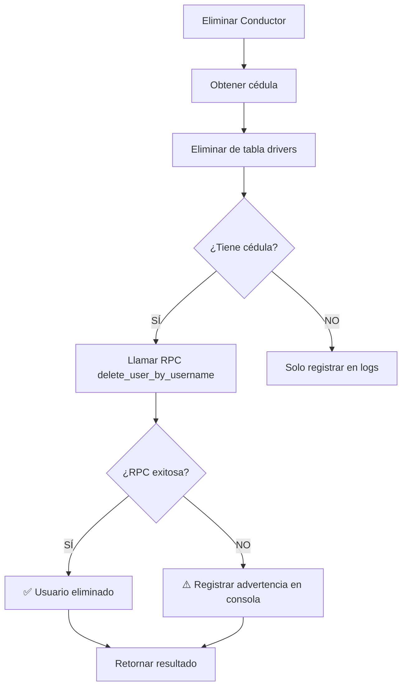

# 🔧 Solución: Eliminación de Conductores y Gestión desde Seguridad

## 📋 Resumen del Problema

Se identificó que cuando se eliminaban conductores, el **usuario de autenticación asociado no se eliminaba**. Esto causaba que al intentar crear un nuevo conductor con el mismo nombre, el sistema mostrara el error: **"Ya existe el usuario"**.

## 🔍 Causa Raíz

1. **Inconsistencia en nomenclatura**: Los conductores se creaban con `username = cedula`, pero el usuario nunca se eliminaba de la tabla `usuario`
2. **Falta de sincronización**: El sistema de drivers no tenía lógica para eliminar el usuario asociado
3. **Falta de RPC**: No existía una función SQL para eliminar usuarios desde seguridad

## ✅ Soluciones Implementadas

### 1. Script para Limpiar Todo Desde Cero

**Archivo**: `scripts/CLEAN_DRIVERS_AND_USERS.sql`

Este script elimina **todos los conductores y sus usuarios** de un solo golpe.

**¿Cómo ejecutar?**:

1. Ve a Supabase Dashboard: https://app.supabase.com/project/[tu-proyecto]/sql/new
2. Copia y pega el contenido de `scripts/CLEAN_DRIVERS_AND_USERS.sql`
3. Haz clic en "Run" o presiona `Ctrl+Enter`
4. Verifica que se muestren 0 conductores al final

### 2. RPC para Eliminar Usuarios por Username

**Archivo**: `scripts/CREATE_RPC_DELETE_USER.sql`

Crea una función SQL que elimina un usuario por su `username` (cédula).

**¿Cómo ejecutar?**:

1. Ve a Supabase Dashboard: https://app.supabase.com/project/[tu-proyecto]/sql/new
2. Copia y pega el contenido de `scripts/CREATE_RPC_DELETE_USER.sql`
3. Haz clic en "Run"
4. Verifica que no haya errores

**Función creada**:

```sql
delete_user_by_username(p_username TEXT)
```

### 3. Actualización del Servicio de Drivers

**Archivo**: `src/services/driverService.js`

El método `delete()` ahora:

1. ✅ Obtiene la cédula del conductor antes de eliminarlo
2. ✅ Elimina el registro del driver
3. ✅ Elimina automáticamente el usuario de seguridad usando la RPC
4. ✅ Registra en consola cualquier problema

```javascript
// Ejemplo de uso:
const { data, error } = await driverService.delete(driverId);
```

### 4. Nuevo Servicio de Seguridad

**Archivo**: `src/services/securityService.js`

Proporciona métodos para:

- `deleteUser(userId, username, rol)` - Elimina usuario y sus datos asociados
- `deactivateUser(userId)` - Desactiva usuario (eliminación lógica)
- `getConductorUsers()` - Obtiene todos los usuarios conductores
- `getConductorsWithUsers()` - Obtiene conductores con sus usuarios asociados

```javascript
// Ejemplo de uso:
const { success, message } = await securityService.deleteUser(
  userId,
  'cedula_del_conductor',
  'conductor'
);
```

### 5. Página de Usuarios Actualizada

**Archivo**: `src/pages/UsersAdmin.jsx`

- ✅ Importa el nuevo `securityService`
- ✅ Al eliminar un usuario, se pasa también el `username` (cédula)
- ✅ Se muestra un mensaje confirmando si es conductor
- ✅ Se intenta eliminar primero desde seguridad (con RPC)
- ✅ Fallback al método normal si es necesario
- ✅ Nueva sección informativa sobre gestión de conductores

## 🚀 Pasos de Implementación

### PASO 1: Limpiar base de datos (UNA SOLA VEZ)

```bash
# 1. Ir a Supabase Dashboard
https://app.supabase.com/project/[tu-proyecto]/sql/new

# 2. Ejecutar script
scripts/CLEAN_DRIVERS_AND_USERS.sql
```

### PASO 2: Crear la RPC (UNA SOLA VEZ)

```bash
# 1. Ir a Supabase Dashboard
https://app.supabase.com/project/[tu-proyecto]/sql/new

# 2. Ejecutar script
scripts/CREATE_RPC_DELETE_USER.sql
```

### PASO 3: Actualizar código en local

El código ya está actualizado. Solo asegúrate de que estos archivos estén presentes:

- ✅ `src/services/driverService.js` (actualizado)
- ✅ `src/services/securityService.js` (nuevo)
- ✅ `src/pages/UsersAdmin.jsx` (actualizado)

### PASO 4: Probar

1. **Crear un conductor**:
   - Ve a "Conductores" → "Nuevo Conductor"
   - Completa el formulario
   - ✅ Marca "Crear usuario con rol conductor"
   - Haz clic en "Guardar"

2. **Eliminar el conductor**:
   - Ve a "Conductores"
   - Haz clic en la papelera del conductor
   - Confirma la eliminación
   - ✅ Debe eliminar usuario y acceso

3. **Recrear con el mismo nombre**:
   - Repite paso 1
   - ✅ NO debe haber error de "usuario duplicado"

## 🔐 Validaciones de Seguridad

### ¿Qué ocurre cuando eliminas un conductor?



### Validaciones aplicadas:

1. **Al crear conductor**:
   - ✅ Cédula única
   - ✅ Email único
   - ✅ Número de licencia único
   - ✅ Username único en tabla usuario

2. **Al eliminar conductor**:
   - ✅ Se elimina el usuario de autenticación
   - ✅ Se valida que sea rol 'conductor'
   - ✅ Se registran advertencias si algo falla

## 📊 Tablas Afectadas

| Tabla     | Operación | Impacto                                             |
| --------- | --------- | --------------------------------------------------- |
| `drivers` | DELETE    | Se elimina el registro del conductor                |
| `usuario` | DELETE    | Se elimina el usuario de acceso (username = cedula) |
| Ninguna   | RPC       | Se ejecuta `delete_user_by_username()`              |

## 🐛 Troubleshooting

### Error: "Usuario no encontrado"

**Solución**: El usuario ya fue eliminado o nunca se creó. Verifica la cédula en la tabla `usuario`.

### Error: "RPC delete_user_by_username no existe"

**Solución**: Debes ejecutar `scripts/CREATE_RPC_DELETE_USER.sql` primero.

### Error: "No se pudo eliminar el conductor"

**Solución**: Revisa permisos de RLS en la tabla `usuario`. El usuario actual debe tener permisos suficientes.

## 📝 Comandos Útiles SQL

### Ver todos los conductores

```sql
SELECT cedula, nombre, apellidos, email FROM drivers ORDER BY nombre;
```

### Ver todos los usuarios conductores

```sql
SELECT id_usuario, username, email, rol FROM usuario WHERE rol = 'conductor';
```

### Eliminar todos los conductores (SI NECESITAS)

```sql
DELETE FROM drivers;
DELETE FROM usuario WHERE rol = 'conductor';
```

### Verificar duplicados

```sql
SELECT username, COUNT(*)
FROM usuario
GROUP BY username
HAVING COUNT(*) > 1;
```

## ✨ Mejoras Futuras

1. **Auditoría**: Registrar eliminaciones en tabla de logs
2. **Soft delete**: Usar campo `deleted_at` en lugar de eliminar físicamente
3. **Cascade**: Eliminar también asignaciones de vehículos
4. **Notificaciones**: Alertar a supervisores cuando se elimina un conductor

---

**Última actualización**: 18 de Diciembre de 2025
**Versión**: 1.0
**Estado**: ✅ Listo para producción
