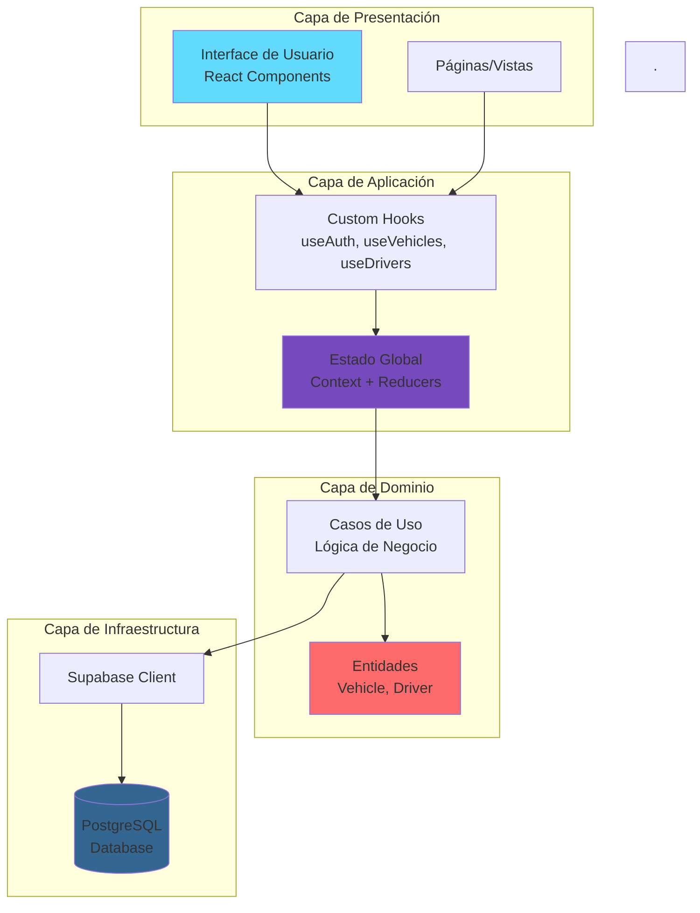
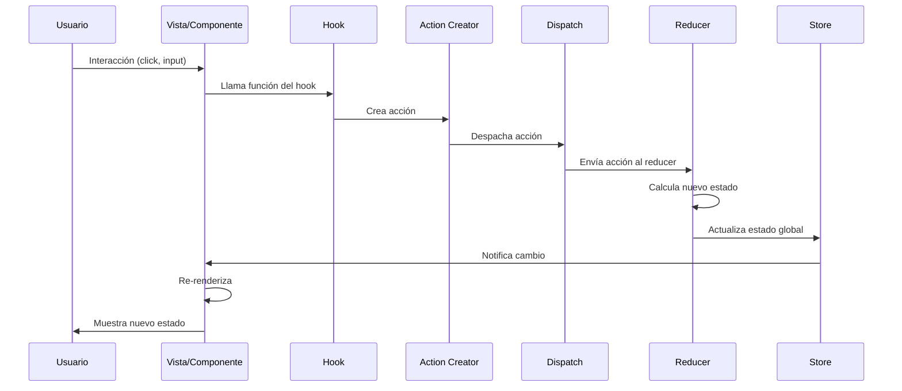
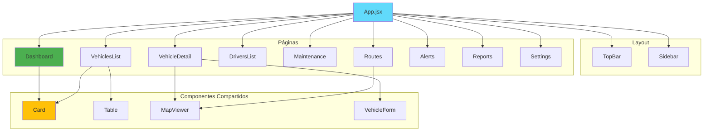
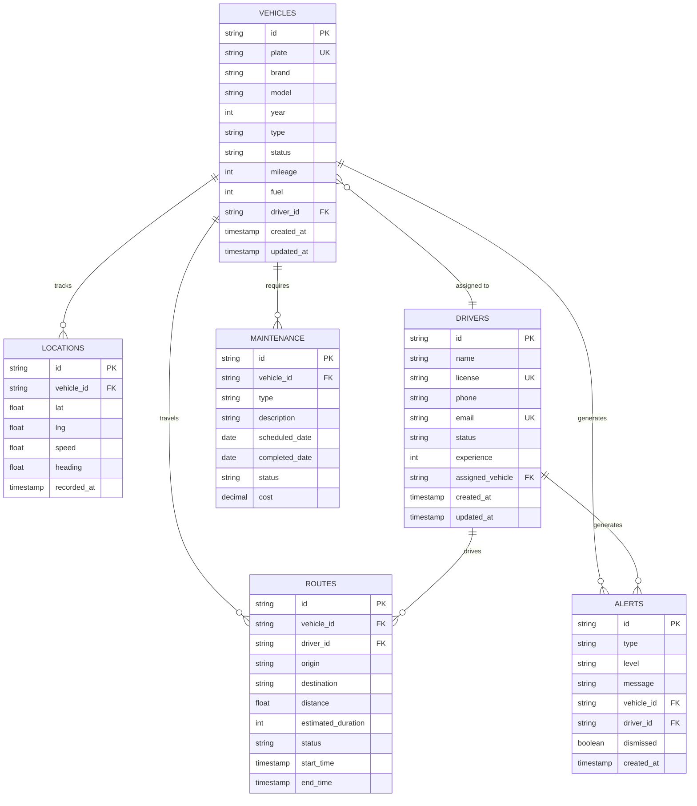
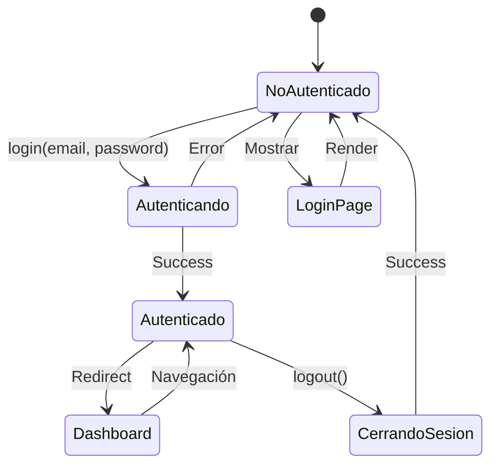
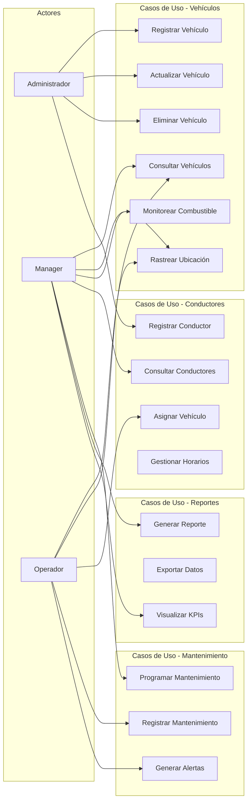
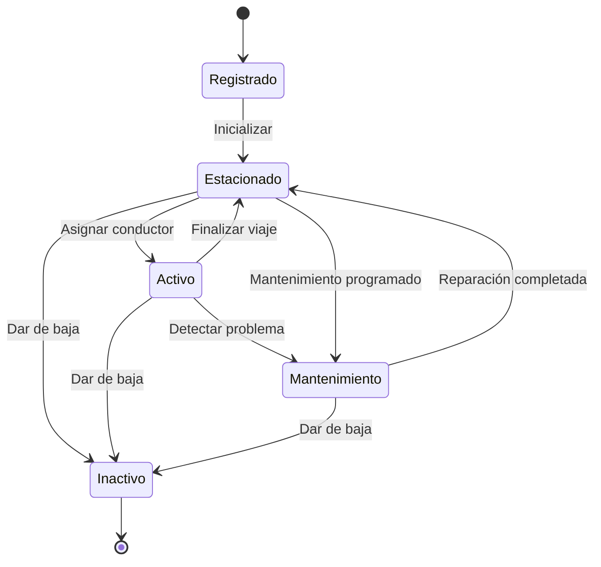
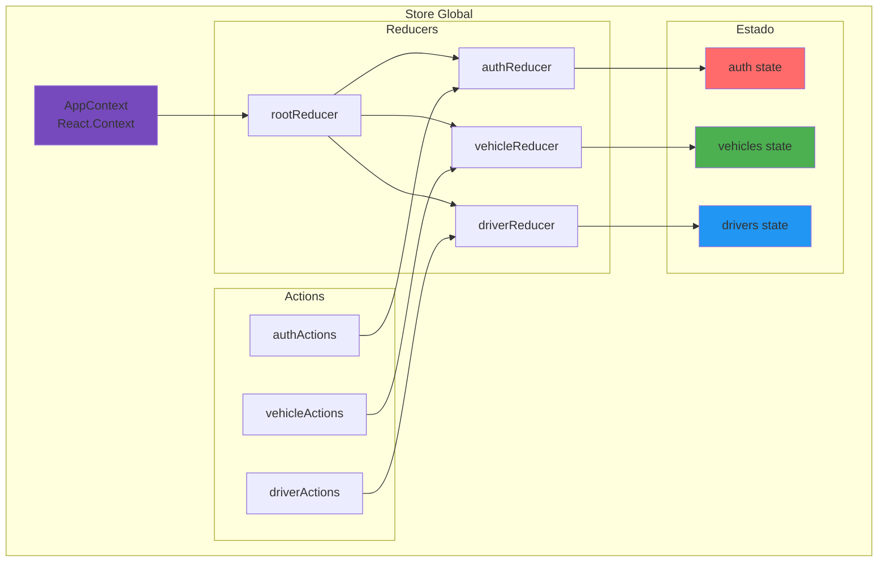
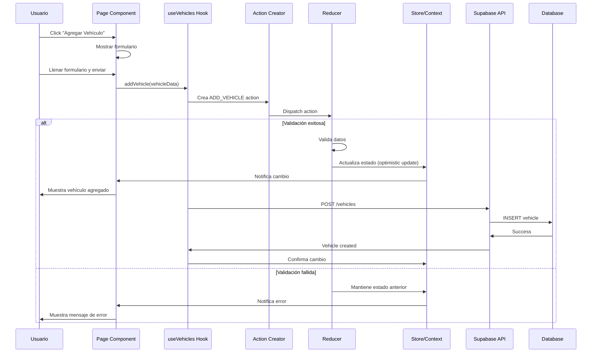

# Diagrama de Arquitectura del Sistema

Este archivo contiene todos los diagramas técnicos del sistema FleetManager utilizando Mermaid.

## 1. Arquitectura General del Sistema

## 2. Flujo de Datos Unidireccional (Flux Pattern)

## 3. Arquitectura de Componentes

## 4. Modelo de Datos (Entidad-Relación)

## 5. Flujo de Autenticación

## 6. Casos de Uso Principales

## 7. Flujo de Estado de Vehículos

## 8. Arquitectura del Store (Estado Global)

## 9. Flujo de una Feature Completa

## 10. Estructura de Hooks Personalizados

```mermaid
graph TB
    subgraph "Custom Hooks"
        useAuth[useAuth]
        useVehicles[useVehicles]
        useDrivers[useDrivers]
    end

    subgraph "Funcionalidades useAuth"
        login[login]
        logout[logout]
        user[user state]
        isAuth[isAuthenticated]
    end

    subgraph "Funcionalidades useVehicles"
        addV[addVehicle]
        updateV[updateVehicle]
        deleteV[deleteVehicle]
        filterV[filterVehicles]
        getV[getVehicleById]
        statsV[getVehicleStats]
    end

    subgraph "Funcionalidades useDrivers"
        addD[addDriver]
        updateD[updateDriver]
        deleteD[deleteDriver]
        getD[getDriverById]
        activeD[getActiveDrivers]
        statsD[getDriverStats]
    end

    useAuth --> login
    useAuth --> logout
    useAuth --> user
    useAuth --> isAuth

    useVehicles --> addV
    useVehicles --> updateV
    useVehicles --> deleteV
    useVehicles --> filterV
    useVehicles --> getV
    useVehicles --> statsV

    useDrivers --> addD
    useDrivers --> updateD
    useDrivers --> deleteD
    useDrivers --> getD
    useDrivers --> activeD
    useDrivers --> statsD

    style useAuth fill:#FF6B6B
    style useVehicles fill:#4CAF50
    style useDrivers fill:#2196F3
```

