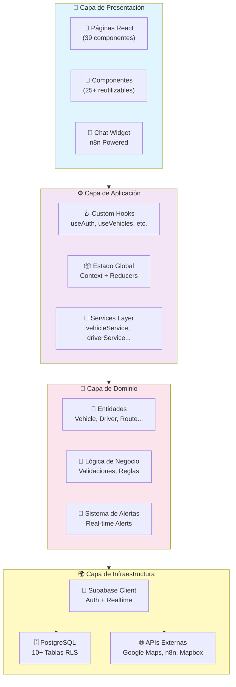
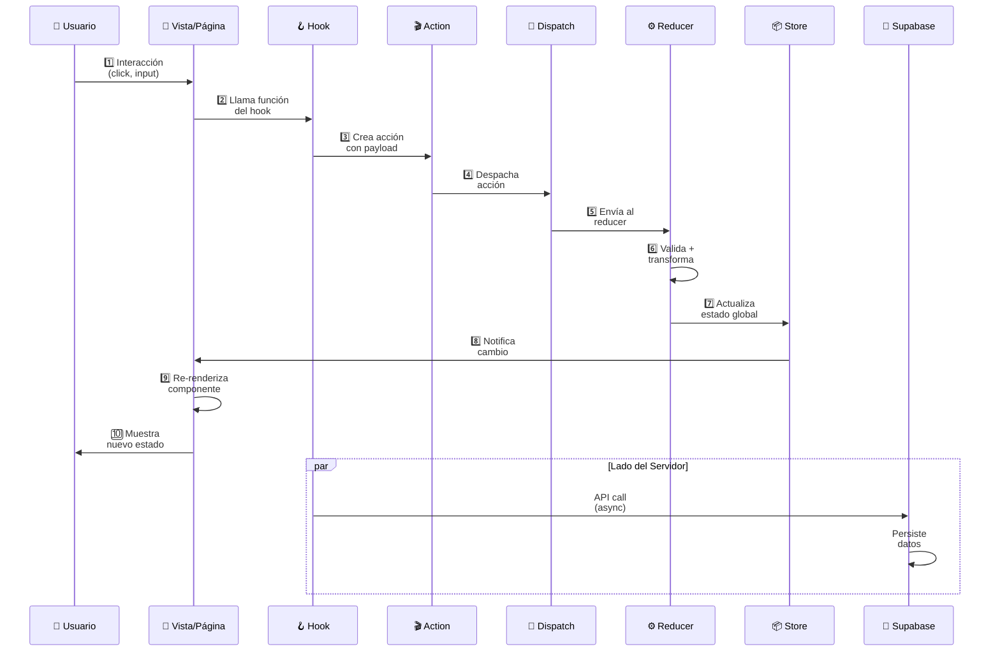
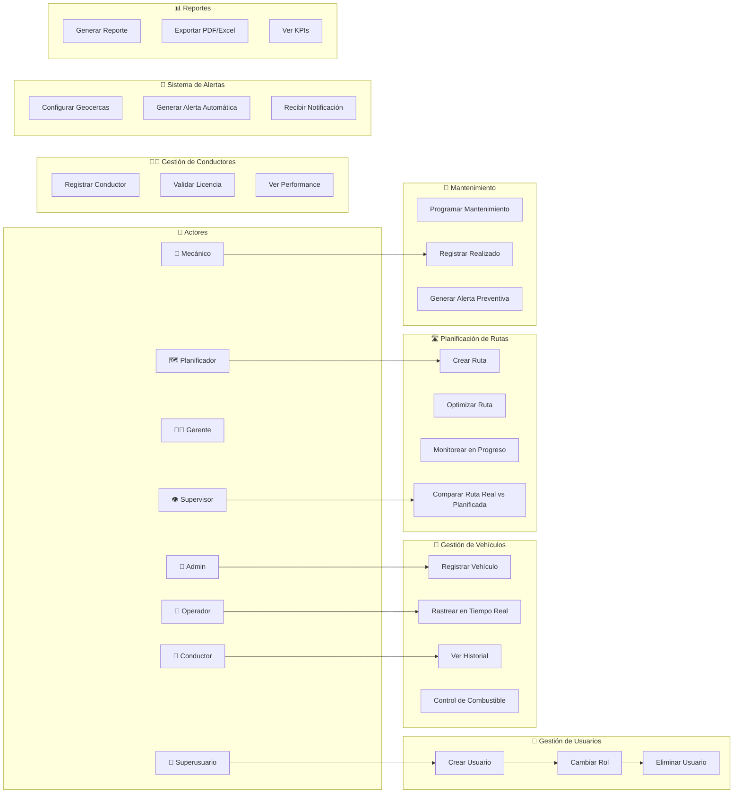
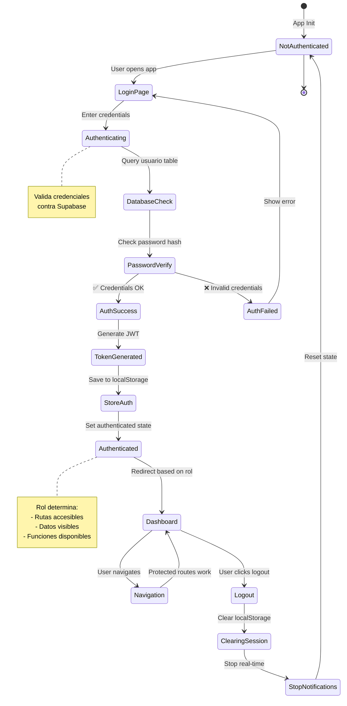
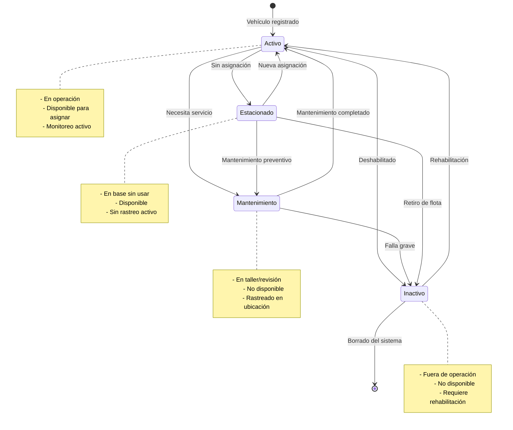
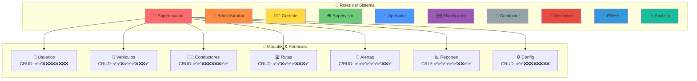

# 📊 Diagramas Completos del Sistema FlotaVehicular v2.0.0

**Versión**: 2.0.0  
**Última actualización**: Diciembre 2025  
**Formato**: Mermaid (compatible con GitHub, GitLab, Notion, Confluence)

---

## 📑 Índice de Diagramas

1. [Arquitectura General del Sistema](#1-arquitectura-general)
2. [Flujo de Datos (Flux Pattern)](#2-flujo-de-datos-flux)
3. [Casos de Uso Principales](#3-casos-de-uso)
4. [Diagrama Entidad-Relación (BD)](#4-diagrama-er)
5. [Flujo de Autenticación](#5-flujo-autenticacion)
6. [Arquitectura de Componentes](#6-arquitectura-componentes)
7. [Flujo del Chatbot n8n](#7-flujo-chatbot)
8. [Estados de Vehículos](#8-estados-vehiculos)
9. [Flujo de Gestión de Rutas](#9-flujo-rutas)
10. [Matriz de Permisos por Rol](#10-matriz-permisos)

---

## 1. Arquitectura General del Sistema {#1-arquitectura-general}



---

## 2. Flujo de Datos (Flux Pattern) {#2-flujo-de-datos-flux}



---

## 3. Casos de Uso Principales {#3-casos-de-uso}



---

## 4. Diagrama Entidad-Relación (BD) {#4-diagrama-er}

```mermaid
erDiagram
    USUARIO ||--o{ VEHICULO : "gestiona"
    USUARIO ||--o{ CONDUCTOR : "supervisa"
    USUARIO ||--o{ ALERTA : "configura"
    USUARIO ||--o{ MANTENIMIENTO_HISTORY : "crea"

    CONDUCTOR ||--o{ ASIGNACION : "tiene"
    CONDUCTOR ||--o{ INCIDENTE : "reporta"
    CONDUCTOR ||--o{ COMBUSTIBLE : "registra"
    CONDUCTOR ||--|| USUARIO : "login"

    VEHICULO ||--o{ ASIGNACION : "asignado"
    VEHICULO ||--o{ ALERTA : "genera"
    VEHICULO ||--o{ INCIDENTE : "involucrado"
    VEHICULO ||--o{ MANTENIMIENTO : "requiere"
    VEHICULO ||--o{ COMBUSTIBLE : "consume"
    VEHICULO ||--o{ ALERT_TRACKING : "monitoreado"
    VEHICULO ||--o{ VEHICLE_LOCATIONS : "ubicacion"
    VEHICULO ||--o{ ROUTE_TRACKING : "ruta"

    RUTA ||--o{ ASIGNACION : "planificada"
    RUTA ||--o{ ROUTE_ASSIGNMENTS : "asignada"
    RUTA ||--o{ ROUTE_WAYPOINT_CHECKINS : "checkpoint"

    ASIGNACION ||--o{ INCIDENTE : "contexto"
    ASIGNACION ||--o{ ROUTE_EVENTS : "evento"

    MANTENIMIENTO ||--o{ MANTENIMIENTO_HISTORY : "realizado"
    MANTENIMIENTO ||--o{ MAINTENANCE_ORDERS : "generada"

    MAINTENANCE_ORDERS ||--o{ MAINTENANCE_PARTS : "contiene"
    MAINTENANCE_ORDERS ||--o{ MAINTENANCE_ATTACHMENTS : "adjunta"

    ALERTA ||--o{ ALERT_RULES : "basada_en"
    ALERTA ||--o{ ALERT_TRACKING : "sigue"
    ALERTA ||--o{ INCIDENT_NOTIFICATIONS : "notifica"

    GEOCERCA ||--o{ GEOFENCE_EVENTS : "genera"
    GEOCERCA ||--o{ GEOFENCE_STATE : "monitora"

    REPORT_TEMPLATES ||--o{ REPORT_SCHEDULES : "usa"
    REPORT_SCHEDULES ||--o{ REPORT_EXECUTIONS : "ejecuta"

    INCIDENTE ||--o{ INCIDENT_COMMENTS : "comenta"
    INCIDENTE ||--o{ INCIDENT_NOTIFICATIONS : "notifica"

    USUARIO : int id_usuario PK
    USUARIO : string username
    USUARIO : string email
    USUARIO : string rol
    USUARIO : boolean activo

    CONDUCTOR : int id_conductor PK
    CONDUCTOR : string nombre_completo
    CONDUCTOR : string cedula
    CONDUCTOR : date fecha_venc_licencia
    CONDUCTOR : string estado

    VEHICULO : string placa PK
    VEHICULO : string marca
    VEHICULO : string modelo
    VEHICULO : int año
    VEHICULO : int kilometraje
    VEHICULO : string estado

    RUTA : int id_ruta PK
    RUTA : string nombre
    RUTA : string origen
    RUTA : string destino
    RUTA : numeric distancia_km

    ASIGNACION : int id_asignacion PK
    ASIGNACION : int id_conductor FK
    ASIGNACION : string placa_vehiculo FK
    ASIGNACION : int id_ruta FK
    ASIGNACION : timestamp fecha_inicio
    ASIGNACION : string estado

    INCIDENTE : int id_incidente PK
    INCIDENTE : string placa_vehiculo FK
    INCIDENTE : int id_conductor FK
    INCIDENTE : date fecha
    INCIDENTE : string tipo
    INCIDENTE : string gravedad

    MANTENIMIENTO : int id_mantenimiento PK
    MANTENIMIENTO : string placa_vehiculo FK
    MANTENIMIENTO : string tipo
    MANTENIMIENTO : date fecha
    MANTENIMIENTO : numeric costo

    ALERTA : int id PK
    ALERTA : int vehicle_id FK
    ALERTA : string tipo_alerta
    ALERTA : string nivel_prioridad
    ALERTA : string estado

    GEOCERCA : int id PK
    GEOCERCA : string nombre
    GEOCERCA : jsonb geometry
    GEOCERCA : boolean activo
```

---

## 5. Flujo de Autenticación {#5-flujo-autenticacion}



---

## 6. Arquitectura de Componentes {#6-arquitectura-componentes}

```mermaid
graph TB
    App["🎯 App.jsx<br/>Root Component"]

    subgraph Layout["🎨 Layout Components"]
        TopBar["📱 TopBar<br/>User, Notifications"]
        Sidebar["📌 Sidebar<br/>Navigation Menu"]
        ChatWidget["💬 ChatbotWidget<br/>n8n Integration"]
    end

    subgraph Pages["📄 Pages/Vistas<br/>39 Components"]
        Auth["🔐 LoginPage"]
        Dashboard["📊 Dashboard"]
        Vehicles["🚙 VehiclesList, VehicleDetail"]
        Drivers["👨‍✈️ DriversList, DriverDetail"]
        Routes["🛣️ Routes, RoutesList, RouteMonitoring"]
        Maintenance["🔧 Maintenance"]
        Alerts["🚨 Alerts, AlertRulesConfig"]
        Reports["📈 Reports"]
        Settings["⚙️ Settings, UsersAdmin"]
        Monitoring["📡 RealTimeMonitoring, Geofences"]
    end

    subgraph Shared["🧩 Shared Components<br/>25+ Reutilizables"]
        Common["Card, Table, Button<br/>Modal, Input, Select"]
        Forms["VehicleForm, DriverForm<br/>RouteForm, MaintenanceForm"]
        Maps["MapViewer, GeoMap<br/>RouteMap, HeatMap"]
        Charts["Chart, KPICard<br/>SpeedChart, ConsumptionChart"]
    end

    subgraph State["📦 State Management"]
        Context["🔄 AppContext<br/>Global State"]
        Reducers["⚙️ Reducers<br/>Actions, Updates"]
        Hooks["🪝 Custom Hooks<br/>useVehicles, useDrivers..."]
    end

    subgraph Services["🔧 Service Layer"]
        VehicleService["vehicleService.js"]
        DriverService["driverService.js"]
        RouteService["routeService.js"]
        AlertService["alertService.js"]
        ChatService["chatService.js"]
        NotificationService["notificationService.js"]
    end

    subgraph Infrastructure["🌐 Infrastructure"]
        SupabaseClient["🔌 SupabaseClient<br/>Auth, DB, Realtime"]
        APIs["🌍 External APIs<br/>Google Maps, Mapbox, n8n"]
    end

    App --> Layout
    App --> Pages
    Pages --> Shared
    Layout --> Shared

    Shared --> State
    Pages --> State

    State --> Services
    Services --> Infrastructure
    Infrastructure --> SupabaseClient
    Infrastructure --> APIs

    style App fill:#61DAFB
    style Layout fill:#4CAF50
    style Pages fill:#FF9800
    style Shared fill:#FFC107
    style State fill:#9C27B0
    style Services fill:#E91E63
    style Infrastructure fill:#009688
```



---

## 7. Flujo del Chatbot n8n {#7-flujo-chatbot}

```mermaid
sequenceDiagram
    participant U as 👤 Usuario
    participant W as 💬 ChatWidget<br/>Frontend
    participant WH as 🪝 Webhook<br/>n8n Cloud
    participant EC as 🔍 Extract<br/>Context
    participant MM as 💾 Memory<br/>Manager
    participant AI as 🤖 AI Agent<br/>DeepSeek v3.1
    participant LLM as 🧠 OpenRouter<br/>LLM API
    participant WR as 📮 Webhook<br/>Response

    U->>W: Escribe pregunta
    W->>W: Construye payload<br/>{message, history, context}
    W->>WH: POST a webhook<br/>n8n Cloud

    WH->>EC: 1️⃣ Extract Context<br/>Extrae datos
    EC->>MM: 2️⃣ Conversation Memory<br/>Gestiona historial
    MM->>AI: 3️⃣ AI Agent Init<br/>Con contexto proyecto

    AI->>AI: 4️⃣ Format Prompt<br/>System: Asistente FlotaVehicular<br/>User: Pregunta

    AI->>LLM: 5️⃣ LLM Request<br/>DeepSeek via OpenRouter
    LLM->>LLM: 🧠 Procesa<br/>Genera respuesta
    LLM->>AI: Retorna respuesta

    AI->>AI: 6️⃣ Parse Response<br/>Valida + formatea
    AI->>WR: 7️⃣ Envía resultado
    WR->>W: 📦 JSON Response<br/>{reply, timestamp}
    W->>U: 💬 Muestra respuesta

    U->>W: ✅ Continúa conversación
    W->>WH: Siguiente mensaje<br/>Con historial

    note over AI
        System Prompt contiene:
        • 35+ preguntas guía
        • Arquitectura proyecto
        • 10 roles + permisos
        • Restricciones claras
    end note
```

---

## 8. Estados de Vehículos {#8-estados-vehiculos}



---

## 9. Flujo de Gestión de Rutas {#9-flujo-rutas}

```mermaid
graph LR
    A["📋 Crear Ruta"] --> B["🗺️ Definir Waypoints<br/>Origen, Destino, Paradas"]
    B --> C["📊 Optimizar<br/>Google Maps API<br/>Calcula distancia + tiempo"]
    C --> D["💾 Guardar Ruta<br/>Estado: 'Programada'"]

    D --> E["👨‍✈️ Asignar Conductor<br/>+ Vehículo<br/>+ Horario"]
    E --> F["📍 Asignación Activa<br/>Estado: 'En Curso'"]

    F --> G["📡 Monitoreo Real-time<br/>GPS cada 30s"]
    G --> H["🔍 Comparar Ruta<br/>Planificada vs Real"]
    H --> I["🚨 Alertas Dinámicas<br/>Desvío, Exceso Vel,<br/>Parada Prolongada"]

    I --> J["✅ Ruta Completada<br/>Estado: 'Completada'"]
    J --> K["📊 Generar Reporte<br/>Distancia real, Tiempo<br/>Combustible, KPIs"]
    K --> L["📈 Historiales<br/>Análisis de rutas<br/>Comparativas"]

    style A fill:#4CAF50
    style C fill:#FF9800
    style G fill:#2196F3
    style J fill:#4CAF50
```



---

## 10. Matriz de Permisos por Rol {#10-matriz-permisos}



---

## 📚 Leyenda y Convenciones

### Colores en Diagramas

- 🟦 Azul: Componentes/Interfaces
- 🟩 Verde: Éxito/Operaciones válidas
- 🟥 Rojo: Errores/Restricciones
- 🟨 Amarillo: Advertencias/Datos

### Símbolos Mermaid

- `-->`: Relación/Flujo unidireccional
- `<-->`: Relación bidireccional
- `||`: Cardinalidad 1
- `o{`: Cardinalidad 0 o 1
- `}o`: Cardinalidad muchos

### Notación en Documentación

- ✅ Permitido
- ❌ No permitido
- ⏳ En progreso
- 🔄 Recurrente
- 📌 Importante

---

## 🔗 Referencias Relacionadas

- [Casos de Uso Detallados](./CASOS_USO_DETALLADOS.md)
- [Modelo Físico de BD](./DB_MODELO_FISICO.md)
- [Arquitectura General](../ARQUITECTURA.md)
- [Backlog del Producto](../BACKLOG_PRODUCTO.md)
- [Arquitectura del Chatbot](../n8n/ARQUITECTURA_CHATBOT.md)

---

## 📝 Mantenimiento

**Última revisión**: Diciembre 18, 2025  
**Próxima revisión**: Marzo 2026  
**Responsable**: Equipo de Arquitectura

Para actualizar estos diagramas, asegúrate de:

1. Mantener la consistencia entre diagramas relacionados
2. Validar que los roles y permisos reflejen la realidad
3. Documentar cambios en el historial de versiones
4. Probar los diagramas en Mermaid Live Editor

---

**FIN DEL DOCUMENTO**
