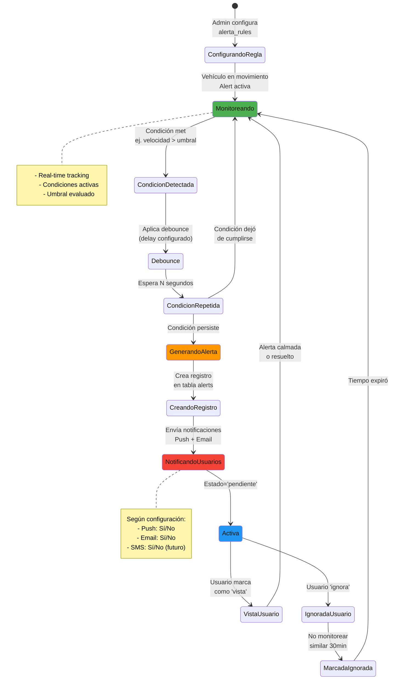
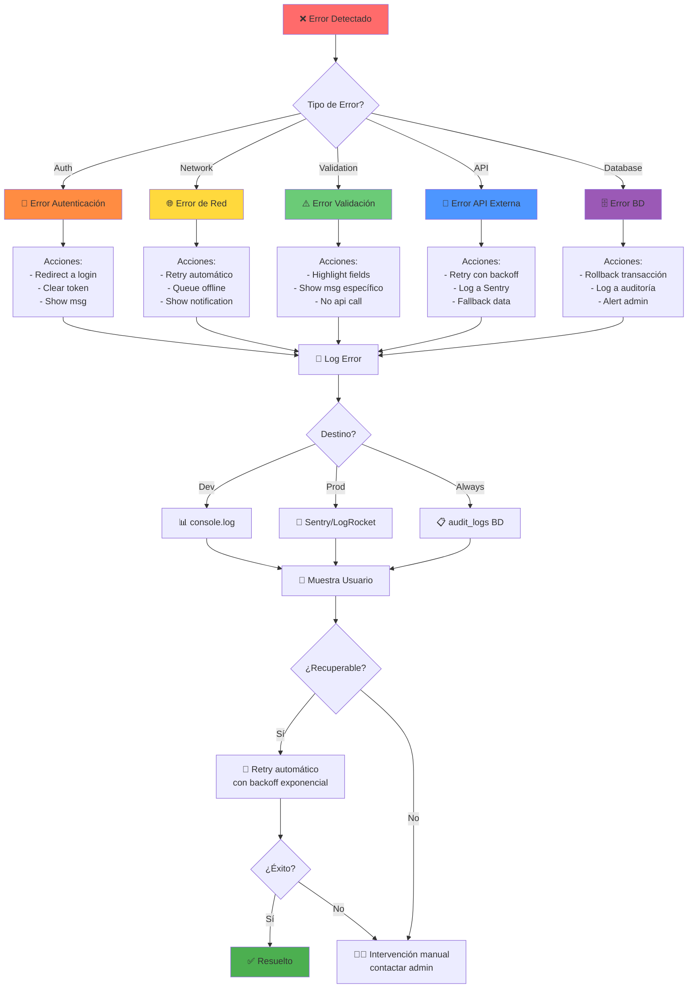
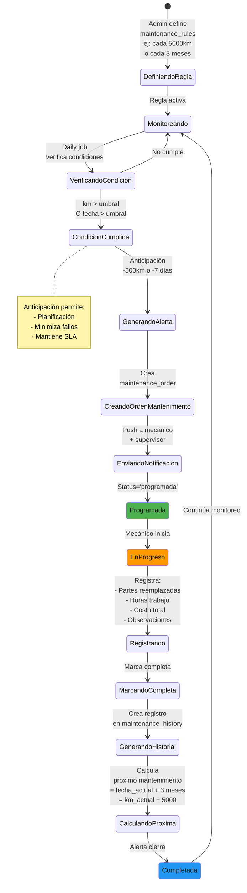
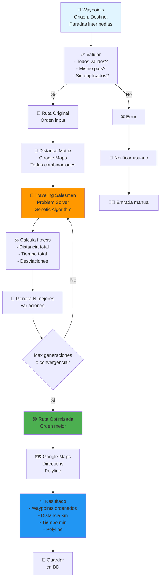
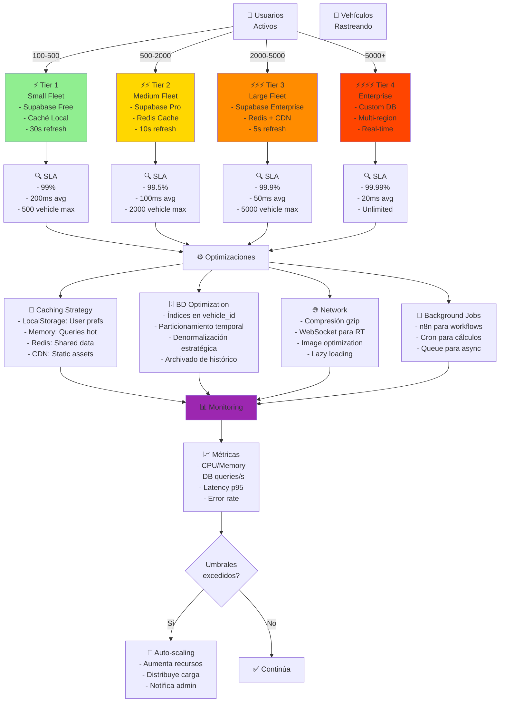

# 🔧 Diagramas Técnicos Avanzados - Mermaid

**Versión**: 2.0.0  
**Contenido**: Diagramas técnicos especializados del sistema

---

## 📋 Índice

1. [Flujo de Integración con APIs Externas](#flujo-apis)
2. [Ciclo de Vida de una Alerta](#ciclo-alerta)
3. [Flujo de Sincronización de Datos](#flujo-sync)
4. [Gestión de Errores y Excepciones](#manejo-errores)
5. [Matriz de Matriz de Casos Exito/Fracaso](#matriz-exito)
6. [Ciclo de Vida de Mantenimiento Preventivo](#ciclo-mantenimiento)
7. [Algoritmo de Optimización de Rutas](#algoritmo-rutas)
8. [Escalabilidad y Performance](#escalabilidad)

---

## 1. Flujo de Integración con APIs Externas {#flujo-apis}

```mermaid
graph TB
    subgraph Frontend["🎨 Frontend (React)"]
        Component["Componente<br/>solicita datos"]
    end

    subgraph LocalCache["💾 Cache Local"]
        Cache["LocalStorage<br/>+ Memory Cache"]
    end

    subgraph Services["🔧 Services Layer"]
        Service["googleMapsService<br/>mapboxService<br/>n8nService"]
    end

    subgraph SupabaseLayer["🌍 Supabase Layer"]
        SupabaseClient["SupabaseClient<br/>Auth + DB + Realtime"]
    end

    subgraph ExternalAPIs["🌐 APIs Externas"]
        GMaps["🗺️ Google Maps<br/>Directions<br/>Distance Matrix<br/>Geocoding"]
        Mapbox["🗺️ Mapbox<br/>Static Maps<br/>Tileset"]
        n8n["🤖 n8n Cloud<br/>Chatbot Workflow"]
        OpenRouter["🧠 OpenRouter<br/>DeepSeek v3.1"]
    end

    subgraph PostgresDB["🗄️ PostgreSQL"]
        DB["Datos Persistentes<br/>RLS enabled<br/>Triggers activos"]
    end

    Component -->|1. Check cache| Cache
    Cache -->|2. Miss| Service

    Service -->|3. Valida creds| SupabaseClient
    SupabaseClient -->|4. GetJWT| SupabaseClient

    SupabaseClient -->|5a. Llamada| GMaps
    SupabaseClient -->|5b. Llamada| Mapbox
    SupabaseClient -->|5c. Llamada| n8n
    n8n -->|→| OpenRouter

    GMaps -->|6a. Respuesta| Service
    Mapbox -->|6b. Respuesta| Service
    n8n -->|6c. Respuesta| Service

    Service -->|7. Parsea| Service
    Service -->|8. Cachea| Cache
    Service -->|9. Retorna| Component

    par Persistencia
        Service -->|INSERT/UPDATE| SupabaseClient
        SupabaseClient -->|→| DB
        DB -->|Triggers| DB
    end

    style Frontend fill:#e1f5ff
    style Services fill:#f3e5f5
    style ExternalAPIs fill:#fff9c4
    style PostgresDB fill:#fce4ec
```

---

## 2. Ciclo de Vida de una Alerta {#ciclo-alerta}



---

## 3. Flujo de Sincronización de Datos {#flujo-sync}

```mermaid
sequenceDiagram
    participant Frontend as 💻 Frontend
    participant LocalDB as 💾 IndexedDB Local
    participant SupabaseRT as 🔌 Supabase Realtime
    participant PostgreSQL as 🗄️ PostgreSQL
    participant RLS as 🔐 RLS Policies

    rect rgb(200, 220, 255)
        note over Frontend, PostgreSQL
            INICIALIZACIÓN - Cuando usuario se autentica
        end
    end

    Frontend->>LocalDB: 1. Clear IndexedDB
    Frontend->>SupabaseRT: 2. Subscribe a tablas<br/>vehicles, routes, alerts

    SupabaseRT->>RLS: 3. Validate JWT
    RLS-->>SupabaseRT: ✅ Permisos OK

    SupabaseRT->>PostgreSQL: 4. SELECT * WHERE user_has_access
    PostgreSQL-->>SupabaseRT: Initial snapshot
    SupabaseRT-->>Frontend: Datos iniciales

    Frontend->>LocalDB: 5. Store snapshot
    Frontend->>Frontend: 6. Renderiza UI

    rect rgb(200, 255, 200)
        note over Frontend, PostgreSQL
            OPERACIÓN - Usuario hace cambio
        end
    end

    Frontend->>Frontend: 7. Optimistic update<br/>en local
    Frontend->>SupabaseRT: 8. POST/PUT/DELETE

    SupabaseRT->>RLS: 9. Valida permiso

    alt Permisos OK
        RLS-->>SupabaseRT: ✅ Autorizado
        SupabaseRT->>PostgreSQL: 10. Ejecuta operación
        PostgreSQL->>PostgreSQL: 11. Trigger ejecuta<br/>lógica negocio
        PostgreSQL-->>SupabaseRT: ✅ Success
        SupabaseRT->>SupabaseRT: 12. Broadcast a<br/>otros clientes
    else Permisos Fallan
        RLS-->>SupabaseRT: ❌ Denegado
        SupabaseRT-->>Frontend: Error
        Frontend->>LocalDB: Revert cambio local
    end

    rect rgb(255, 200, 200)
        note over SupabaseRT, PostgreSQL
            TIEMPO REAL - Cambio en otra sesión
        end
    end

    PostgreSQL->>SupabaseRT: 13. Change broadcast
    SupabaseRT->>Frontend: 14. Websocket update

    Frontend->>LocalDB: 15. Sync cambio
    Frontend->>Frontend: 16. Re-renderiza
    Frontend-->>Frontend: 17. Merge con local<br/>si hay conflictos
```

---

## 4. Gestión de Errores y Excepciones {#manejo-errores}



---

## 5. Ciclo de Vida de Mantenimiento Preventivo {#ciclo-mantenimiento}



---

## 6. Algoritmo de Optimización de Rutas {#algoritmo-rutas}



---

## 7. Escalabilidad y Performance {#escalabilidad}



---

## 8. Flujo de Notificaciones Multicanal {#notificaciones}

```mermaid
sequenceDiagram
    participant Event as 🔔 Event<br/>Trigger
    participant Queue as 📮 Queue<br/>RabbitMQ/n8n
    participant NotifSvc as 📧 Notification<br/>Service
    participant Push as 📲 Push<br/>Firebase
    participant Email as ✉️ Email<br/>SendGrid
    participant SMS as 📱 SMS<br/>Twilio
    participant User as 👤 Usuario

    Event->>Queue: 1. Enqueue<br/>notificación

    Queue->>NotifSvc: 2. Dequeue evento

    NotifSvc->>NotifSvc: 3. Valida:<br/>- Usuario existe<br/>- Preferencias ON<br/>- No está en DND

    alt Validación OK
        NotifSvc->>Push: 4a. Push notification
        Push->>Push: Envia a Firebase
        Push->>User: 📲 Notif en mobile

        NotifSvc->>Email: 4b. Email notification
        Email->>Email: Renderiza template
        Email->>User: ✉️ Email recibido

        NotifSvc->>SMS: 4c. SMS (si crítica)
        SMS->>User: 📱 SMS recibido

        NotifSvc->>NotifSvc: 5. Log evento<br/>en BD
    else Validación Falla
        NotifSvc->>NotifSvc: Descarta
    end

    User->>User: 6. Recibe notificación
    User->>User: 7. Interactúa o ignora

    par Tracking
        NotifSvc->>NotifSvc: Track delivery
        NotifSvc->>NotifSvc: Track read/click
    end

    note over NotifSvc
        Preferencias usuario:
        - Canal preferido (push/email/sms)
        - Horario silencioso
        - Tipos alertas
    end note
```

---

## 📊 Resumen de Diagramas Técnicos

| Diagrama       | Propósito                 | Usuarios Objetivo          |
| -------------- | ------------------------- | -------------------------- |
| Flujo APIs     | Integraciones externas    | Developers                 |
| Ciclo Alerta   | Sistema alertas           | QA, Supervisores           |
| Sync Datos     | Realtime sincronización   | Developers, DevOps         |
| Manejo Errores | Robustez sistema          | Developers, QA             |
| Mantenimiento  | Gestión preventiva        | Supervisores, Mecánicos    |
| Rutas Óptimas  | Planificación inteligente | Planificadores, Operadores |
| Escalabilidad  | Capacidad sistema         | DevOps, Arquitectos        |
| Notificaciones | Multi-canal               | Developers, Product        |

---

**Última actualización**: Diciembre 18, 2025  
**Validado por**: Equipo Técnico  
**Próxima revisión**: Marzo 2026
