# Diagrama General de Casos de Uso

> Ver también: `Diagrama_Secuencia_Casos_Uso.md` para los flujos detallados de cada caso de uso.

```mermaid
%%{init: {'theme':'base', 'themeVariables': { 'primaryColor':'#61DAFB'}}}%%
graph TB
    subgraph Sistema["Sistema de Gestión de Flota"]
        subgraph ModuloVehiculos["Módulo de Vehículos"]
            UC1[Registrar Vehículo]
            UC2[Actualizar Datos Vehículo]
            UC3[Eliminar Vehículo]
            UC4[Consultar Vehículos]
            UC5[Rastrear Ubicación Tiempo Real]
            UC6[Monitorear Combustible]
            UC7[Ver Historial Vehículo]
            UC8[Asociar Vehículo a Conductor]
            UC9[Ver Geocercas]
        end
        subgraph ModuloConductores["Módulo de Conductores"]
            UC10[Registrar Conductor]
            UC11[Actualizar Datos Conductor]
            UC12[Eliminar Conductor]
            UC13[Consultar Conductores]
            UC14[Ver Historial Conductor]
            UC15[Gestionar Horarios y Turnos]
            UC16[Ver Incidentes]
        end
        subgraph ModuloMantenimiento["Módulo de Mantenimiento"]
            UC17[Programar Mantenimiento]
            UC18[Registrar Mantenimiento Realizado]
            UC19[Consultar Historial Mantenimiento]
            UC20[Generar Alerta Mantenimiento]
            UC21[Calcular Próximo Mantenimiento]
        end
        subgraph ModuloRutas["Módulo de Rutas"]
            UC22[Crear Ruta]
            UC23[Asignar Ruta a Vehículo/Conductor]
            UC24[Monitorear Ruta en Progreso]
            UC25[Finalizar Ruta]
            UC26[Optimizar Rutas]
            UC27[Comparar Ruta Planificada vs Real]
        end
        subgraph ModuloAlertas["Módulo de Alertas"]
            UC28[Ver Alertas Activas]
            UC29[Generar Alerta Automática]
            UC30[Descartar Alerta]
            UC31[Configurar Notificaciones]
            UC32[Configurar Geocercas]
            UC33[Alertas por Velocidad/Detención/Desvío]
        end
        subgraph ModuloIncidentes["Módulo de Incidentes"]
            UC34[Reportar Incidente/Emergencia]
            UC35[Recibir Notificación de Incidente]
            UC36[Generar Reporte de Incidentes]
        end
        subgraph ModuloReportes["Módulo de Reportes"]
            UC37[Generar Reporte Vehículos]
            UC38[Generar Reporte Conductores]
            UC39[Generar Reporte Mantenimiento]
            UC40[Generar Reporte Combustible]
            UC41[Exportar Reporte PDF]
            UC42[Exportar Reporte Excel]
            UC43[Ver Dashboard KPIs]
            UC44[Reportes Personalizados]
        end
        subgraph ModuloIntegraciones["Módulo de Integraciones"]
            UC45[Integrar con Sistemas de Tráfico/Mapas]
            UC46[Integrar con ERP]
            UC47[Comunicación Central-Conductor]
        end
        subgraph ModuloConfig["Módulo de Configuración y Seguridad"]
            UC48[Gestionar Usuarios y Roles]
            UC49[Configurar Parámetros del Sistema]
            UC50[Configurar Políticas de Privacidad]
            UC51[Almacenar Datos Históricos]
        end
        subgraph ModuloAuth["Módulo de Autenticación"]
            UC52[Iniciar Sesión]
            UC53[Cerrar Sesión]
            UC54[Recuperar Contraseña]
            UC55[Cambiar Contraseña]
        end
    end
    Admin((Administrador))
    Manager((Supervisor))
    Operator((Operador))
    Viewer((Visualizador))
    Driver((Conductor))
    Sistema_Externo[Sistema Externo<br/>GPS/Sensores/ERP]
    Admin --> UC1
    Admin --> UC2
    Admin --> UC3
    Admin --> UC10
    Admin --> UC11
    Admin --> UC12
    Admin --> UC15
    Admin --> UC48
    Admin --> UC49
    Admin --> UC50
    Admin --> UC51
    Admin --> UC52
    Admin --> UC53
    Admin --> UC54
    Admin --> UC55
    Manager --> UC4
    Manager --> UC5
    Manager --> UC6
    Manager --> UC7
    Manager --> UC8
    Manager --> UC9
    Manager --> UC13
    Manager --> UC14
    Manager --> UC15
    Manager --> UC16
    Manager --> UC17
    Manager --> UC18
    Manager --> UC19
    Manager --> UC20
    Manager --> UC22
    Manager --> UC23
    Manager --> UC24
    Manager --> UC25
    Manager --> UC26
    Manager --> UC27
    Manager --> UC28
    Manager --> UC29
    Manager --> UC30
    Manager --> UC31
    Manager --> UC32
    Manager --> UC33
    Manager --> UC34
    Manager --> UC35
    Manager --> UC36
    Manager --> UC37
    Manager --> UC38
    Manager --> UC39
    Manager --> UC40
    Manager --> UC41
    Manager --> UC42
    Manager --> UC43
    Manager --> UC44
    Manager --> UC45
    Manager --> UC46
    Manager --> UC47
    Manager --> UC48
    Manager --> UC49
    Manager --> UC50
    Manager --> UC51
    Manager --> UC52
    Manager --> UC53
    Manager --> UC54
    Manager --> UC55
    Operator --> UC4
    Operator --> UC5
    Operator --> UC13
    Operator --> UC16
    Operator --> UC18
    Operator --> UC24
    Operator --> UC25
    Operator --> UC28
    Operator --> UC34
    Operator --> UC35
    Operator --> UC52
    Operator --> UC53
    Operator --> UC54
    Operator --> UC55
    Driver --> UC34
    Driver --> UC35
    Driver --> UC52
    Driver --> UC53
    Driver --> UC54
    Driver --> UC55
    Viewer --> UC4
    Viewer --> UC5
    Viewer --> UC13
    Viewer --> UC28
    Viewer --> UC43
    Sistema_Externo -.-> UC5
    Sistema_Externo -.-> UC6
    Sistema_Externo -.-> UC29
    Sistema_Externo -.-> UC45
    Sistema_Externo -.-> UC46
    UC29 --> UC33
    UC20 --> UC33
    UC34 --> UC35
    UC36 --> UC35
```

## Casos de Uso Detallados

### Registrar Vehículo

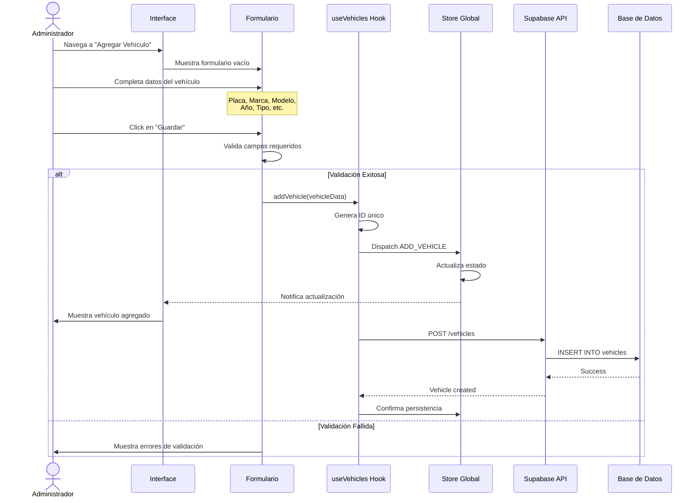

### Configurar Geocerca y Alertas

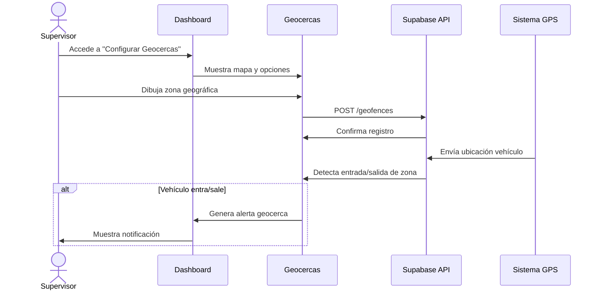

### Reportar Incidente/Emergencia

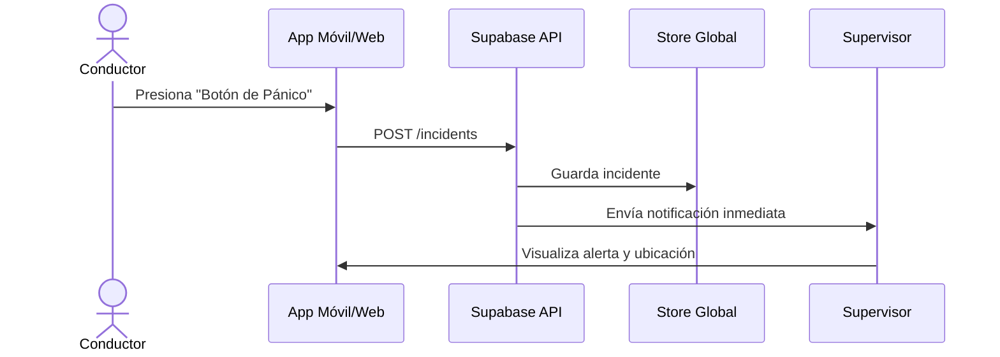

### Integrar con Sistema Externo (ERP/Tráfico)

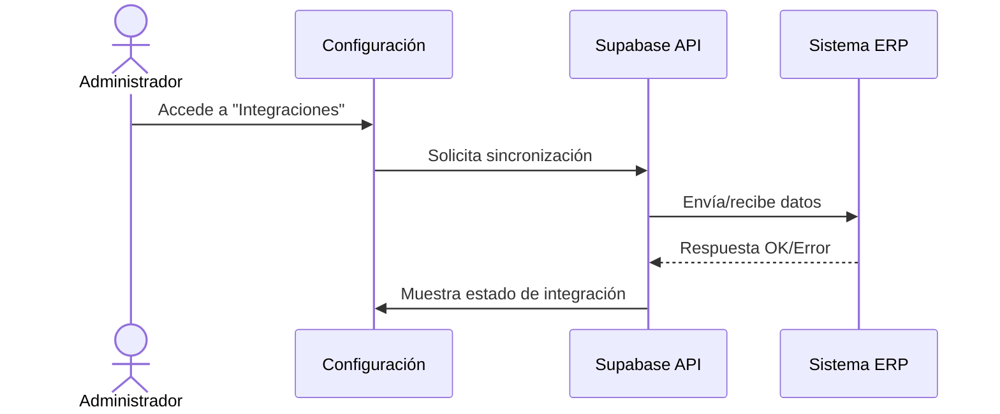

### Gestionar Usuarios y Roles

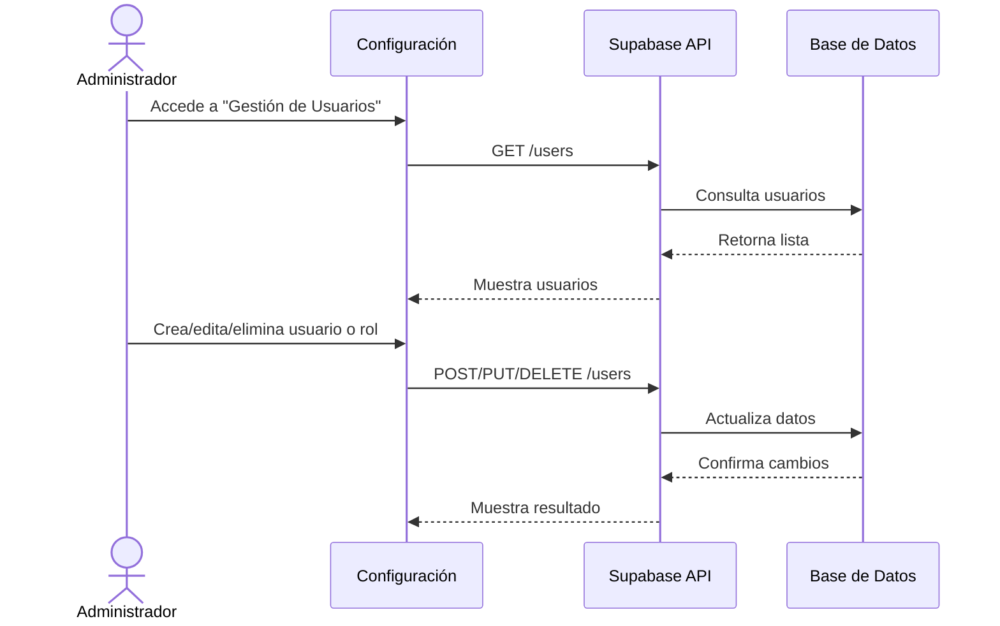

### Exportar Reporte PDF/Excel

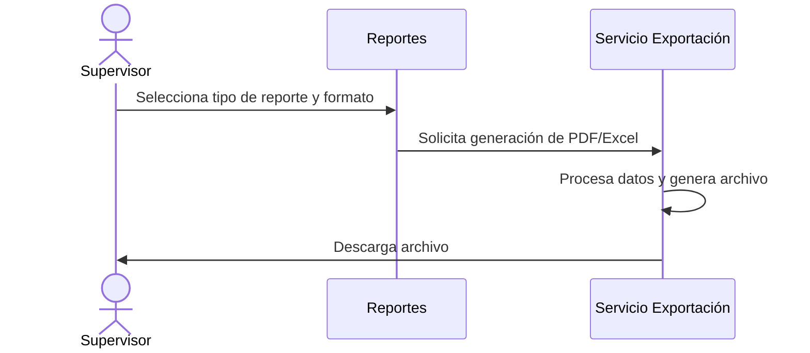

## Caso de Uso Detallado: Monitorear Vehículo en Tiempo Real

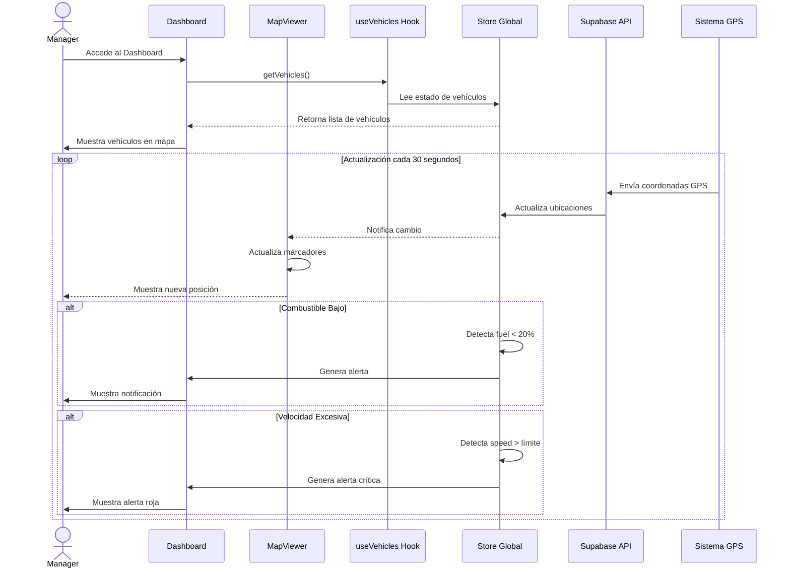

## Caso de Uso Detallado: Asignar Conductor a Vehículo

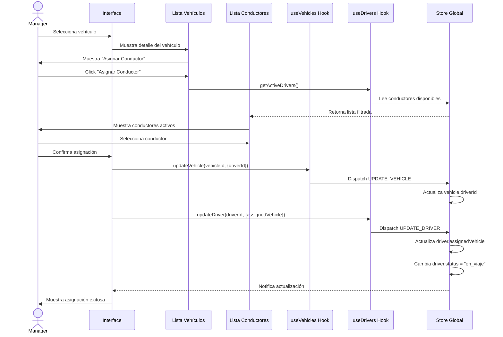

## Caso de Uso: Generar Reporte de Mantenimiento

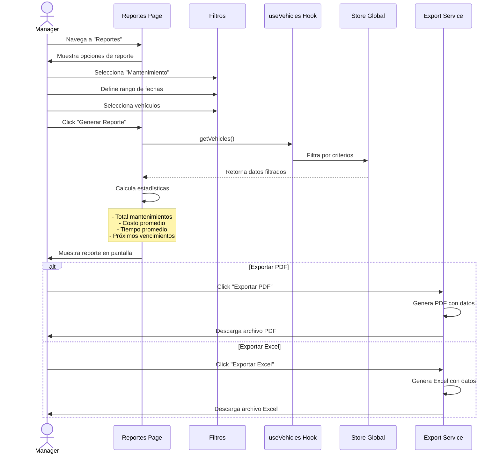

## Matriz de Casos de Uso por Rol

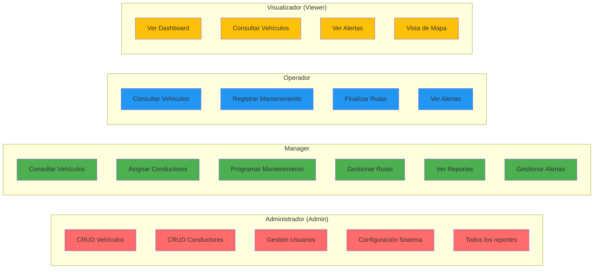
