# Diagrama de Clases del Sistema

Este documento contiene el diagrama de clases UML del sistema FlotaVehicular, representando la arquitectura de código con entidades del dominio, componentes React, hooks personalizados y el store global.

## Descripción

El diagrama muestra:

- **Entidades del dominio** (`core/entities`): Vehicle, Driver
- **Componentes React** (`components/`, `pages/`): Dashboard, VehiclesList, DriversList, Card, MapViewer, etc.
- **Hooks personalizados** (`hooks/`): useVehicles, useDrivers, useAuth
- **Store global** (`store/`): Reducers, Actions, Context
- **Relaciones**: Composición, uso, dependencias

## Diagrama de Clases (Mermaid UML)

```mermaid
classDiagram
    %% ===== ENTIDADES DEL DOMINIO =====
    class Vehicle {
        -string id
        -string plate
        -string brand
        -string model
        -number year
        -string type
        -string status
        -number mileage
        -number capacity
        -string lastMaintenanceDate
        +constructor(data)
        +updateMileage(newMileage)
        +changeStatus(newStatus)
        +toJSON() Object
        +isValid() boolean
    }

    class Driver {
        -string id
        -string name
        -string license
        -string phone
        -string email
        -string status
        -number experience
        -string assignedVehicle
        -string createdAt
        -string updatedAt
        +constructor(data)
        +assignVehicle(vehicleId)
        +unassignVehicle()
        +toJSON() Object
        +isValid() boolean
    }

    %% ===== STORE (Estado Global) =====
    class AppContext {
        -Object state
        -Function dispatch
        +AppProvider(children) JSX
        +useAppContext() Context
    }

    class RootReducer {
        +rootReducer(state, action) Object
        +initialState Object
    }

    class VehicleReducer {
        -Array vehicles
        -Array filteredVehicles
        -Object filters
        -boolean loading
        -string error
        +vehicleReducer(state, action) Object
    }

    class DriverReducer {
        -Array drivers
        -Object selectedDriver
        -boolean loading
        -string error
        +driverReducer(state, action) Object
    }

    class AuthReducer {
        -Object user
        -boolean isAuthenticated
        -boolean loading
        -string error
        +authReducer(state, action) Object
    }

    class VehicleActions {
        +setVehiclesAction(vehicles) Action
        +addVehicleAction(vehicle) Action
        +updateVehicleAction(vehicle) Action
        +deleteVehicleAction(id) Action
        +filterVehiclesAction(filters) Action
    }

    class DriverActions {
        +setDriversAction(drivers) Action
        +addDriverAction(driver) Action
        +updateDriverAction(driver) Action
        +deleteDriverAction(id) Action
    }

    class AuthActions {
        +loginAction(user) Action
        +logoutAction() Action
        +setUserAction(user) Action
    }

    %% ===== HOOKS PERSONALIZADOS =====
    class useVehicles {
        +vehicles Array
        +filteredVehicles Array
        +filters Object
        +loading boolean
        +error string
        +addVehicle(vehicle) Vehicle
        +updateVehicle(id, data) void
        +deleteVehicle(id) void
        +filterVehicles(filters) void
        +getVehicleById(id) Vehicle
        +getVehiclesByStatus(status) Array
        +getVehicleStats() Object
    }

    class useDrivers {
        +drivers Array
        +loading boolean
        +error string
        +addDriver(driver) Driver
        +updateDriver(id, data) void
        +deleteDriver(id) void
        +getDriverById(id) Driver
        +getActiveDrivers() Array
        +getDriverStats() Object
    }

    class useAuth {
        +user Object
        +isAuthenticated boolean
        +loading boolean
        +error string
        +login(credentials) void
        +logout() void
    }

    %% ===== COMPONENTES REACT (Pages) =====
    class Dashboard {
        +render() JSX
        -calculateKPIs() Object
        -getActiveVehicles() Array
    }

    class VehiclesList {
        +render() JSX
        -handleAddVehicle() void
        -handleEditVehicle(id) void
        -handleDeleteVehicle(id) void
    }

    class VehicleDetail {
        +render() JSX
        -handleUpdate() void
        -handleDelete() void
    }

    class DriversList {
        +render() JSX
        -handleAddDriver() void
        -handleEditDriver(id) void
        -handleDeleteDriver(id) void
    }

    class Maintenance {
        +render() JSX
        -handleScheduleMaintenance() void
    }

    class Routes {
        +render() JSX
        -handleCreateRoute() void
    }

    class Alerts {
        +render() JSX
        -handleDismissAlert(id) void
    }

    class Reports {
        +render() JSX
        -handleGenerateReport() void
        -handleExportPDF() void
    }

    class Settings {
        +render() JSX
        -handleSaveSettings() void
    }

    class LoginPage {
        +render() JSX
        -handleLogin() void
    }

    %% ===== COMPONENTES REACT (Componentes Reutilizables) =====
    class Card {
        +title string
        +children ReactNode
        +className string
        +render() JSX
    }

    class MapViewer {
        +vehicles Array
        +center Object
        +zoom number
        +render() JSX
        -renderMarkers() JSX
    }

    class Table {
        +columns Array
        +data Array
        +onRowClick Function
        +render() JSX
    }

    class VehicleForm {
        +vehicle Object
        +onSubmit Function
        +onCancel Function
        +render() JSX
        -handleChange() void
        -handleSubmit() void
    }

    class Sidebar {
        +isOpen boolean
        +onClose Function
        +render() JSX
    }

    class TopBar {
        +user Object
        +onLogout Function
        +render() JSX
    }

    class NavBar {
        +activeRoute string
        +render() JSX
    }

    %% ===== CONSTANTES Y UTILIDADES =====
    class Constants {
        +VEHICLE_STATUS Object
        +VEHICLE_TYPES Object
        +DRIVER_STATUS Object
        +ALERT_LEVELS Object
        +ALERT_TYPES Object
    }

    class Utils {
        +formatDate(date) string
        +calculateDistance(lat1, lon1, lat2, lon2) number
        +validateEmail(email) boolean
    }

    %% ===== RELACIONES =====

    %% Store y Reducers
    AppContext --> RootReducer : uses
    RootReducer --> VehicleReducer : combines
    RootReducer --> DriverReducer : combines
    RootReducer --> AuthReducer : combines

    VehicleActions --> VehicleReducer : dispatches to
    DriverActions --> DriverReducer : dispatches to
    AuthActions --> AuthReducer : dispatches to

    %% Hooks y Store
    useVehicles --> AppContext : uses
    useVehicles --> VehicleActions : dispatches
    useDrivers --> AppContext : uses
    useDrivers --> DriverActions : dispatches
    useAuth --> AppContext : uses
    useAuth --> AuthActions : dispatches

    %% Hooks y Entidades
    useVehicles --> Vehicle : manages
    useDrivers --> Driver : manages

    %% Componentes y Hooks
    Dashboard --> useVehicles : uses
    Dashboard --> useDrivers : uses
    Dashboard --> Card : renders
    Dashboard --> MapViewer : renders

    VehiclesList --> useVehicles : uses
    VehiclesList --> Table : renders
    VehiclesList --> VehicleForm : renders

    VehicleDetail --> useVehicles : uses
    VehicleDetail --> Card : renders
    VehicleDetail --> MapViewer : renders
    VehicleDetail --> VehicleForm : renders

    DriversList --> useDrivers : uses
    DriversList --> Table : renders

    Maintenance --> useVehicles : uses
    Routes --> useVehicles : uses
    Routes --> useDrivers : uses
    Alerts --> useVehicles : uses
    Reports --> useVehicles : uses
    Reports --> useDrivers : uses
    Settings --> useAuth : uses
    LoginPage --> useAuth : uses

    %% Componentes reutilizables
    MapViewer --> Vehicle : displays
    VehicleForm --> Vehicle : edits
    Table --> Vehicle : displays
    Table --> Driver : displays

    %% Utilidades
    Dashboard --> Utils : uses
    VehiclesList --> Utils : uses
    DriversList --> Utils : uses
    Reports --> Utils : uses

    Vehicle --> Constants : uses
    Driver --> Constants : uses
```

## Descripción de Clases Principales

### Entidades del Dominio

#### Vehicle

Entidad que representa un vehículo de la flota con sus propiedades y métodos de negocio.

**Propiedades:**

- id, plate, brand, model, year, type, status, mileage, capacity, lastMaintenanceDate

**Métodos:**

- `updateMileage(newMileage)`: Actualiza el kilometraje
- `changeStatus(newStatus)`: Cambia el estado del vehículo
- `toJSON()`: Serializa la entidad
- `isValid()`: Valida los datos

#### Driver

Entidad que representa un conductor con sus credenciales y asignaciones.

**Propiedades:**

- id, name, license, phone, email, status, experience, assignedVehicle

**Métodos:**

- `assignVehicle(vehicleId)`: Asigna vehículo al conductor
- `unassignVehicle()`: Desasigna vehículo
- `toJSON()`: Serializa la entidad
- `isValid()`: Valida los datos

### Store (Estado Global)

#### AppContext

Context principal que provee el estado global y dispatch a toda la aplicación.

#### Reducers

- **VehicleReducer**: Maneja el estado de vehículos (lista, filtros, loading, error)
- **DriverReducer**: Maneja el estado de conductores
- **AuthReducer**: Maneja autenticación y usuario actual

#### Actions

- **VehicleActions**: Creadores de acciones para vehículos (CRUD)
- **DriverActions**: Creadores de acciones para conductores (CRUD)
- **AuthActions**: Creadores de acciones para autenticación

### Hooks Personalizados

#### useVehicles

Hook que encapsula toda la lógica de gestión de vehículos. Proporciona acceso al estado de vehículos y funciones CRUD.

#### useDrivers

Hook que encapsula toda la lógica de gestión de conductores. Proporciona acceso al estado de conductores y funciones CRUD.

#### useAuth

Hook que encapsula la lógica de autenticación y manejo de sesión.

### Componentes React

#### Pages

Componentes de página completa que representan vistas principales:

- **Dashboard**: Vista principal con KPIs y resumen
- **VehiclesList**: Listado y gestión de vehículos
- **VehicleDetail**: Detalle de un vehículo específico
- **DriversList**: Listado y gestión de conductores
- **Maintenance**: Gestión de mantenimientos
- **Routes**: Planificación y seguimiento de rutas
- **Alerts**: Gestión de alertas
- **Reports**: Generación de reportes
- **Settings**: Configuración del sistema
- **LoginPage**: Autenticación

#### Componentes Reutilizables

Componentes de UI reutilizables en toda la aplicación:

- **Card**: Tarjeta para mostrar contenido
- **MapViewer**: Visualización de mapas con marcadores
- **Table**: Tabla genérica para datos
- **VehicleForm**: Formulario de vehículo
- **Sidebar**: Barra lateral de navegación
- **TopBar**: Barra superior con usuario
- **NavBar**: Navegación principal

### Utilidades

#### Constants

Constantes de la aplicación (estados, tipos, niveles de alerta, etc.).

#### Utils

Funciones utilitarias (formateo, cálculos, validaciones).

## Patrones Aplicados

1. **Flux Pattern**: Flujo unidireccional de datos con Actions → Reducers → State
2. **Custom Hooks**: Encapsulación de lógica reutilizable
3. **Composition**: Componentes compuestos y reutilizables
4. **Entity Pattern**: Entidades del dominio con lógica de negocio
5. **Context API**: Estado global accesible en toda la app

## Notas

- Las entidades (Vehicle, Driver) contienen lógica de negocio y validaciones
- Los hooks personalizados abstraen el acceso al store y proveen API limpia
- Los componentes son presentacionales y delegan lógica a hooks
- El store sigue arquitectura unidireccional estricta (Flux)

## Referencias

- Arquitectura: `../ARQUITECTURA.md`
- Diagrama ER: `Diagrama_ER.md`
- Casos de Uso: `Diagrama_Casos_Uso.md`

---

> Mantener este diagrama actualizado al agregar nuevas entidades, componentes o hooks.
