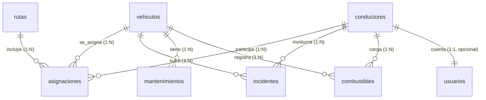

# Modelo Relacional de la Base de Datos

Este documento describe el modelo relacional propuesto del sistema de gestión de flota, derivado del Diagrama Entidad–Relación (ER) en `docs/diagramas/Diagrama_ER.md`, e implementable en PostgreSQL/Supabase.


## Alcance y supuestos

- Motor: PostgreSQL (Supabase). 
- Claves primarias: se usan UUID como claves técnicas para evitar cascadas por cambios de valores de negocio (por ejemplo, placa). Atributos del ER marcados como PK (como `placa_vehiculo`) se mantienen con `UNIQUE NOT NULL`.
- Integridad: todas las FK referencian PK UUID y usan índices automáticos o explícitos.
- Normalización: 3FN, sin duplicación de datos calculables.
- Auditoría: `created_at`, `updated_at` en tablas operativas; disparador para mantener `updated_at`.
- Seguridad: el diseño es compatible con RLS en Supabase (ver Notas RLS).


## Mapeo ER → Tablas

- VEHÍCULO → `vehiculos`
- CONDUCTOR → `conductores`
- ASIGNACIÓN → `asignaciones` (relación N:1 con vehículo, N:1 con conductor y N:1 con ruta)
- RUTA → `rutas`
- INCIDENTE → `incidentes`
- MANTENIMIENTO → `mantenimientos`
- COMBUSTIBLE → `combustibles`
- USUARIO → `usuarios` (vinculable 1:1 con `conductores` cuando aplique)


## Esquema relacional (tablas, columnas y restricciones)

A menos que se indique lo contrario: `NOT NULL` en claves y referencias, y `ON DELETE` según comentario.

### 1) vehiculos
- id UUID PK DEFAULT uuid_generate_v4()
- placa VARCHAR(20) UNIQUE NOT NULL
- marca VARCHAR(100) NOT NULL
- modelo VARCHAR(100) NOT NULL
- anio INTEGER NOT NULL CHECK (anio BETWEEN 1980 AND EXTRACT(YEAR FROM NOW())::INT + 1)
- tipo VARCHAR(50) -- sedán, camión, bus, etc.
- color VARCHAR(50)
- capacidad INTEGER -- en kg o pasajeros
- estado VARCHAR(20) DEFAULT 'disponible' CHECK (estado IN ('disponible','asignado','mantenimiento','inactivo'))
- kilometraje_actual INTEGER DEFAULT 0 CHECK (kilometraje_actual >= 0)
- fecha_ultimo_mantenimiento DATE
- fecha_proximo_mantenimiento DATE
- created_at TIMESTAMPTZ DEFAULT NOW()
- updated_at TIMESTAMPTZ DEFAULT NOW()

Índices sugeridos: (placa), (estado), (fecha_proximo_mantenimiento)


### 2) conductores
- id UUID PK DEFAULT uuid_generate_v4()
- cedula VARCHAR(20) UNIQUE NOT NULL
- nombre VARCHAR(100) NOT NULL
- apellidos VARCHAR(100) NOT NULL
- telefono VARCHAR(20)
- email VARCHAR(255)
- licencia VARCHAR(50)
- tipo_licencia VARCHAR(10) -- B1, C1, C2, etc.
- fecha_vencimiento_licencia DATE
- estado VARCHAR(20) DEFAULT 'activo' CHECK (estado IN ('activo','inactivo','disponible','en_servicio'))
- fecha_ingreso DATE DEFAULT CURRENT_DATE
- created_at TIMESTAMPTZ DEFAULT NOW()
- updated_at TIMESTAMPTZ DEFAULT NOW()

Índices sugeridos: (estado), (cedula)


### 3) rutas
- id UUID PK DEFAULT uuid_generate_v4()
- nombre VARCHAR(255) NOT NULL
- descripcion TEXT
- origen TEXT NOT NULL
- destino TEXT NOT NULL
- distancia_km DECIMAL(8,2)
- tiempo_estimado_min INTEGER
- estado VARCHAR(20) DEFAULT 'planificada' CHECK (estado IN ('planificada','activa','completada','cancelada'))
- created_at TIMESTAMPTZ DEFAULT NOW()
- updated_at TIMESTAMPTZ DEFAULT NOW()

Índices sugeridos: (estado)


### 4) asignaciones
Representa la relación operacional entre vehículo, conductor y ruta. Mantiene historial.

- id UUID PK DEFAULT uuid_generate_v4()
- vehiculo_id UUID REFERENCES vehiculos(id) ON DELETE CASCADE
- conductor_id UUID REFERENCES conductores(id) ON DELETE SET NULL
- ruta_id UUID REFERENCES rutas(id) ON DELETE SET NULL
- fecha_inicio TIMESTAMPTZ NOT NULL DEFAULT NOW()
- fecha_fin TIMESTAMPTZ
- estado VARCHAR(20) DEFAULT 'activa' CHECK (estado IN ('activa','finalizada','suspendida'))
- observaciones TEXT
- created_at TIMESTAMPTZ DEFAULT NOW()
- updated_at TIMESTAMPTZ DEFAULT NOW()

Restricciones adicionales:
- CHECK (fecha_fin IS NULL OR fecha_fin >= fecha_inicio)

Índices sugeridos: (vehiculo_id), (conductor_id), (ruta_id), (estado), (vehiculo_id, fecha_inicio DESC)


### 5) incidentes
- id UUID PK DEFAULT uuid_generate_v4()
- vehiculo_id UUID REFERENCES vehiculos(id) ON DELETE CASCADE
- conductor_id UUID REFERENCES conductores(id) ON DELETE SET NULL
- fecha TIMESTAMPTZ NOT NULL
- tipo VARCHAR(50) NOT NULL -- accidente, averia, infraccion, etc.
- gravedad VARCHAR(20) DEFAULT 'media' CHECK (gravedad IN ('baja','media','alta','critica'))
- titulo VARCHAR(255) NOT NULL
- descripcion TEXT
- ubicacion TEXT
- lat DECIMAL(10,8)
- lng DECIMAL(11,8)
- costo_estimado DECIMAL(10,2)
- costo_real DECIMAL(10,2)
- estado VARCHAR(20) DEFAULT 'reportado' CHECK (estado IN ('reportado','investigando','resuelto','cerrado'))
- created_at TIMESTAMPTZ DEFAULT NOW()
- updated_at TIMESTAMPTZ DEFAULT NOW()

Índices sugeridos: (vehiculo_id), (conductor_id), (fecha DESC), (estado)


### 6) mantenimientos
- id UUID PK DEFAULT uuid_generate_v4()
- vehiculo_id UUID REFERENCES vehiculos(id) ON DELETE CASCADE
- tipo VARCHAR(30) NOT NULL CHECK (tipo IN ('preventivo','correctivo','inspeccion'))
- titulo VARCHAR(255) NOT NULL
- descripcion TEXT
- fecha_programada DATE NOT NULL
- fecha_real DATE
- kilometraje INTEGER CHECK (kilometraje >= 0)
- costo DECIMAL(10,2)
- estado VARCHAR(20) DEFAULT 'programado' CHECK (estado IN ('programado','en_progreso','completado','cancelado'))
- creado_por VARCHAR(255)
- created_at TIMESTAMPTZ DEFAULT NOW()
- updated_at TIMESTAMPTZ DEFAULT NOW()

Índices sugeridos: (vehiculo_id), (fecha_programada DESC), (estado)


### 7) combustibles
- id UUID PK DEFAULT uuid_generate_v4()
- vehiculo_id UUID REFERENCES vehiculos(id) ON DELETE CASCADE
- conductor_id UUID REFERENCES conductores(id) ON DELETE SET NULL
- fecha DATE NOT NULL
- cantidad_litros DECIMAL(8,2) NOT NULL
- costo_por_litro DECIMAL(8,2)
- costo_total DECIMAL(10,2)
- odometro INTEGER
- tipo_combustible VARCHAR(20) DEFAULT 'gasolina' CHECK (tipo_combustible IN ('gasolina','diesel','electrico','hibrido'))
- estacion_nombre VARCHAR(255)
- estacion_direccion TEXT
- numero_recibo VARCHAR(100)
- notas TEXT
- created_at TIMESTAMPTZ DEFAULT NOW()

Índices sugeridos: (vehiculo_id), (conductor_id), (fecha DESC)


### 8) usuarios
- id UUID PK DEFAULT uuid_generate_v4()
- email VARCHAR(255) UNIQUE NOT NULL
- password_hash VARCHAR(255) -- si no se usa autenticación gestionada
- nombres VARCHAR(100) NOT NULL
- apellidos VARCHAR(100) NOT NULL
- rol VARCHAR(50) NOT NULL DEFAULT 'operador' CHECK (rol IN ('admin','supervisor','operador','conductor'))
- es_activo BOOLEAN DEFAULT TRUE
- ultimo_acceso TIMESTAMPTZ
- conductor_id UUID UNIQUE REFERENCES conductores(id) ON DELETE SET NULL -- vinculación 1:1 opcional
- created_at TIMESTAMPTZ DEFAULT NOW()
- updated_at TIMESTAMPTZ DEFAULT NOW()

Índices sugeridos: (rol), (es_activo)


## Diagrama relacional (Mermaid)




## DDL de referencia (PostgreSQL)

Este bloque sirve como guía de implementación. Ajusta nombres según convenga.

```sql
-- Extensiones
CREATE EXTENSION IF NOT EXISTS "uuid-ossp";

-- Función de updated_at
CREATE OR REPLACE FUNCTION set_updated_at() RETURNS TRIGGER AS $$
BEGIN NEW.updated_at = NOW(); RETURN NEW; END; $$ LANGUAGE plpgsql;

-- vehiculos
CREATE TABLE IF NOT EXISTS vehiculos (
  id UUID PRIMARY KEY DEFAULT uuid_generate_v4(),
  placa VARCHAR(20) UNIQUE NOT NULL,
  marca VARCHAR(100) NOT NULL,
  modelo VARCHAR(100) NOT NULL,
  anio INTEGER NOT NULL CHECK (anio BETWEEN 1980 AND EXTRACT(YEAR FROM NOW())::INT + 1),
  tipo VARCHAR(50),
  color VARCHAR(50),
  capacidad INTEGER,
  estado VARCHAR(20) DEFAULT 'disponible' CHECK (estado IN ('disponible','asignado','mantenimiento','inactivo')),
  kilometraje_actual INTEGER DEFAULT 0 CHECK (kilometraje_actual >= 0),
  fecha_ultimo_mantenimiento DATE,
  fecha_proximo_mantenimiento DATE,
  created_at TIMESTAMPTZ DEFAULT NOW(),
  updated_at TIMESTAMPTZ DEFAULT NOW()
);
CREATE INDEX IF NOT EXISTS idx_vehiculos_estado ON vehiculos(estado);
CREATE INDEX IF NOT EXISTS idx_vehiculos_prox_mant ON vehiculos(fecha_proximo_mantenimiento);

-- conductores
CREATE TABLE IF NOT EXISTS conductores (
  id UUID PRIMARY KEY DEFAULT uuid_generate_v4(),
  cedula VARCHAR(20) UNIQUE NOT NULL,
  nombre VARCHAR(100) NOT NULL,
  apellidos VARCHAR(100) NOT NULL,
  telefono VARCHAR(20),
  email VARCHAR(255),
  licencia VARCHAR(50),
  tipo_licencia VARCHAR(10),
  fecha_vencimiento_licencia DATE,
  estado VARCHAR(20) DEFAULT 'activo' CHECK (estado IN ('activo','inactivo','disponible','en_servicio')),
  fecha_ingreso DATE DEFAULT CURRENT_DATE,
  created_at TIMESTAMPTZ DEFAULT NOW(),
  updated_at TIMESTAMPTZ DEFAULT NOW()
);
CREATE INDEX IF NOT EXISTS idx_conductores_estado ON conductores(estado);

-- rutas
CREATE TABLE IF NOT EXISTS rutas (
  id UUID PRIMARY KEY DEFAULT uuid_generate_v4(),
  nombre VARCHAR(255) NOT NULL,
  descripcion TEXT,
  origen TEXT NOT NULL,
  destino TEXT NOT NULL,
  distancia_km DECIMAL(8,2),
  tiempo_estimado_min INTEGER,
  estado VARCHAR(20) DEFAULT 'planificada' CHECK (estado IN ('planificada','activa','completada','cancelada')),
  created_at TIMESTAMPTZ DEFAULT NOW(),
  updated_at TIMESTAMPTZ DEFAULT NOW()
);
CREATE INDEX IF NOT EXISTS idx_rutas_estado ON rutas(estado);

-- asignaciones
CREATE TABLE IF NOT EXISTS asignaciones (
  id UUID PRIMARY KEY DEFAULT uuid_generate_v4(),
  vehiculo_id UUID REFERENCES vehiculos(id) ON DELETE CASCADE,
  conductor_id UUID REFERENCES conductores(id) ON DELETE SET NULL,
  ruta_id UUID REFERENCES rutas(id) ON DELETE SET NULL,
  fecha_inicio TIMESTAMPTZ NOT NULL DEFAULT NOW(),
  fecha_fin TIMESTAMPTZ,
  estado VARCHAR(20) DEFAULT 'activa' CHECK (estado IN ('activa','finalizada','suspendida')),
  observaciones TEXT,
  created_at TIMESTAMPTZ DEFAULT NOW(),
  updated_at TIMESTAMPTZ DEFAULT NOW(),
  CHECK (fecha_fin IS NULL OR fecha_fin >= fecha_inicio)
);
CREATE INDEX IF NOT EXISTS idx_asig_vehiculo ON asignaciones(vehiculo_id);
CREATE INDEX IF NOT EXISTS idx_asig_conductor ON asignaciones(conductor_id);
CREATE INDEX IF NOT EXISTS idx_asig_ruta ON asignaciones(ruta_id);
CREATE INDEX IF NOT EXISTS idx_asig_estado ON asignaciones(estado);
CREATE INDEX IF NOT EXISTS idx_asig_vehiculo_inicio ON asignaciones(vehiculo_id, fecha_inicio DESC);

-- incidentes
CREATE TABLE IF NOT EXISTS incidentes (
  id UUID PRIMARY KEY DEFAULT uuid_generate_v4(),
  vehiculo_id UUID REFERENCES vehiculos(id) ON DELETE CASCADE,
  conductor_id UUID REFERENCES conductores(id) ON DELETE SET NULL,
  fecha TIMESTAMPTZ NOT NULL,
  tipo VARCHAR(50) NOT NULL,
  gravedad VARCHAR(20) DEFAULT 'media' CHECK (gravedad IN ('baja','media','alta','critica')),
  titulo VARCHAR(255) NOT NULL,
  descripcion TEXT,
  ubicacion TEXT,
  lat DECIMAL(10,8),
  lng DECIMAL(11,8),
  costo_estimado DECIMAL(10,2),
  costo_real DECIMAL(10,2),
  estado VARCHAR(20) DEFAULT 'reportado' CHECK (estado IN ('reportado','investigando','resuelto','cerrado')),
  created_at TIMESTAMPTZ DEFAULT NOW(),
  updated_at TIMESTAMPTZ DEFAULT NOW()
);
CREATE INDEX IF NOT EXISTS idx_inc_vehiculo ON incidentes(vehiculo_id);
CREATE INDEX IF NOT EXISTS idx_inc_conductor ON incidentes(conductor_id);
CREATE INDEX IF NOT EXISTS idx_inc_fecha ON incidentes(fecha DESC);
CREATE INDEX IF NOT EXISTS idx_inc_estado ON incidentes(estado);

-- mantenimientos
CREATE TABLE IF NOT EXISTS mantenimientos (
  id UUID PRIMARY KEY DEFAULT uuid_generate_v4(),
  vehiculo_id UUID REFERENCES vehiculos(id) ON DELETE CASCADE,
  tipo VARCHAR(30) NOT NULL CHECK (tipo IN ('preventivo','correctivo','inspeccion')),
  titulo VARCHAR(255) NOT NULL,
  descripcion TEXT,
  fecha_programada DATE NOT NULL,
  fecha_real DATE,
  kilometraje INTEGER CHECK (kilometraje >= 0),
  costo DECIMAL(10,2),
  estado VARCHAR(20) DEFAULT 'programado' CHECK (estado IN ('programado','en_progreso','completado','cancelado')),
  creado_por VARCHAR(255),
  created_at TIMESTAMPTZ DEFAULT NOW(),
  updated_at TIMESTAMPTZ DEFAULT NOW()
);
CREATE INDEX IF NOT EXISTS idx_mant_vehiculo ON mantenimientos(vehiculo_id);
CREATE INDEX IF NOT EXISTS idx_mant_prog ON mantenimientos(fecha_programada DESC);
CREATE INDEX IF NOT EXISTS idx_mant_estado ON mantenimientos(estado);

-- combustibles
CREATE TABLE IF NOT EXISTS combustibles (
  id UUID PRIMARY KEY DEFAULT uuid_generate_v4(),
  vehiculo_id UUID REFERENCES vehiculos(id) ON DELETE CASCADE,
  conductor_id UUID REFERENCES conductores(id) ON DELETE SET NULL,
  fecha DATE NOT NULL,
  cantidad_litros DECIMAL(8,2) NOT NULL,
  costo_por_litro DECIMAL(8,2),
  costo_total DECIMAL(10,2),
  odometro INTEGER,
  tipo_combustible VARCHAR(20) DEFAULT 'gasolina' CHECK (tipo_combustible IN ('gasolina','diesel','electrico','hibrido')),
  estacion_nombre VARCHAR(255),
  estacion_direccion TEXT,
  numero_recibo VARCHAR(100),
  notas TEXT,
  created_at TIMESTAMPTZ DEFAULT NOW()
);
CREATE INDEX IF NOT EXISTS idx_comb_vehiculo ON combustibles(vehiculo_id);
CREATE INDEX IF NOT EXISTS idx_comb_conductor ON combustibles(conductor_id);
CREATE INDEX IF NOT EXISTS idx_comb_fecha ON combustibles(fecha DESC);

-- usuarios
CREATE TABLE IF NOT EXISTS usuarios (
  id UUID PRIMARY KEY DEFAULT uuid_generate_v4(),
  email VARCHAR(255) UNIQUE NOT NULL,
  password_hash VARCHAR(255),
  nombres VARCHAR(100) NOT NULL,
  apellidos VARCHAR(100) NOT NULL,
  rol VARCHAR(50) NOT NULL DEFAULT 'operador' CHECK (rol IN ('admin','supervisor','operador','conductor')),
  es_activo BOOLEAN DEFAULT TRUE,
  ultimo_acceso TIMESTAMPTZ,
  conductor_id UUID UNIQUE REFERENCES conductores(id) ON DELETE SET NULL,
  created_at TIMESTAMPTZ DEFAULT NOW(),
  updated_at TIMESTAMPTZ DEFAULT NOW()
);
CREATE INDEX IF NOT EXISTS idx_usuarios_rol ON usuarios(rol);
CREATE INDEX IF NOT EXISTS idx_usuarios_activo ON usuarios(es_activo);

-- triggers updated_at
CREATE TRIGGER trg_vehiculos_updated BEFORE UPDATE ON vehiculos FOR EACH ROW EXECUTE FUNCTION set_updated_at();
CREATE TRIGGER trg_conductores_updated BEFORE UPDATE ON conductores FOR EACH ROW EXECUTE FUNCTION set_updated_at();
CREATE TRIGGER trg_rutas_updated BEFORE UPDATE ON rutas FOR EACH ROW EXECUTE FUNCTION set_updated_at();
CREATE TRIGGER trg_asignaciones_updated BEFORE UPDATE ON asignaciones FOR EACH ROW EXECUTE FUNCTION set_updated_at();
CREATE TRIGGER trg_incidentes_updated BEFORE UPDATE ON incidentes FOR EACH ROW EXECUTE FUNCTION set_updated_at();
CREATE TRIGGER trg_mantenimientos_updated BEFORE UPDATE ON mantenimientos FOR EACH ROW EXECUTE FUNCTION set_updated_at();
CREATE TRIGGER trg_combustibles_updated BEFORE UPDATE ON combustibles FOR EACH ROW EXECUTE FUNCTION set_updated_at();
```


## Notas de RLS (Row Level Security)

- Habilitar RLS por tabla con `ALTER TABLE ... ENABLE ROW LEVEL SECURITY;`.
- Políticas típicas: acceso por rol y/o por pertenencia (si se habilita multiempresa, añadir `empresa_id` en tablas y filtrar por `auth.uid()` ↔ `usuarios`).
- Para operaciones de escritura, definir políticas explícitas por rol (`admin`, `supervisor`, etc.).


## Correspondencia con migraciones existentes

En `supabase/migrations/` hay dos enfoques: 

1) Un esquema amplio con tablas como `companies`, `users`, `drivers`, `vehicles` (UUID, en inglés, con multiempresa y RLS predefinidas).
2) Un esquema simplificado en español con `vehicles`, `drivers`, `assignments`, `locations`, `alerts` (ids `SERIAL`).

El modelo de este documento prioriza el ER en español y buenas prácticas (UUID, checks, índices). Si deseas alinear 100% con el esquema (1):
- Renombrar tablas a inglés y añadir `company_id` en todas las tablas para multi-tenancy.
- Mapear `vehiculos.placa` a `vehicles.plate_number` (UNIQUE).
- `conductores` ↔ `drivers`, `mantenimientos` ↔ `maintenance`, `combustibles` ↔ `fuel_records`, `incidentes` ↔ `incidents`, `rutas` ↔ `routes`, `asignaciones` ↔ histórico de asignación (`vehicles.current_driver_id` puede convivir para “estado actual”).

Si deseas alinear con el esquema (2):
- Sustituir UUID por `SERIAL` y adaptar nombres de columnas a las usadas allí.
- Mantener la estructura de relaciones propuesta aquí (añadiendo tablas faltantes como `mantenimientos`, `combustibles`, `incidentes` si no existen aún).

Indícame cuál de los dos enfoques quieres adoptar para que genere las migraciones exactas correspondientes.
