# Diagramas de Secuencia de Casos de Uso

Este documento compila las secuencias de interacción de los casos de uso definidos en `Diagrama_Casos_Uso.md` y el backlog. Se modelan con Mermaid para lectura rápida y mantienen consistencia con la arquitectura documentada.


## Convenciones y participantes

- Actores: Admin, Manager, Operator, Driver, Viewer
- Participantes típicos: UI (Frontend), Hook (useX), Store (Estado Global), API (Supabase/HTTP), DB (PostgreSQL)
- Externos: GPS (tracking), Maps (mapas), ERP (integración), Notif (servicio notificaciones)
- Notación de errores: se usan bloques `alt` para flujos alternos (validación, permisos, conflictos)


## Índice

- Módulo Vehículos: UC1–UC9
- Módulo Conductores: UC10–UC16
- Módulo Mantenimiento: UC17–UC21
- Módulo Rutas: UC22–UC27
- Módulo Alertas: UC28–UC33
- Módulo Incidentes: UC34–UC36
- Módulo Reportes: UC37–UC44
- Módulo Integraciones: UC45–UC47
- Configuración y Seguridad: UC48–UC51
- Autenticación: UC52–UC55
- Casos de uso potenciales


---
## Módulo Vehículos (UC1–UC9)

### UC1 Registrar Vehículo
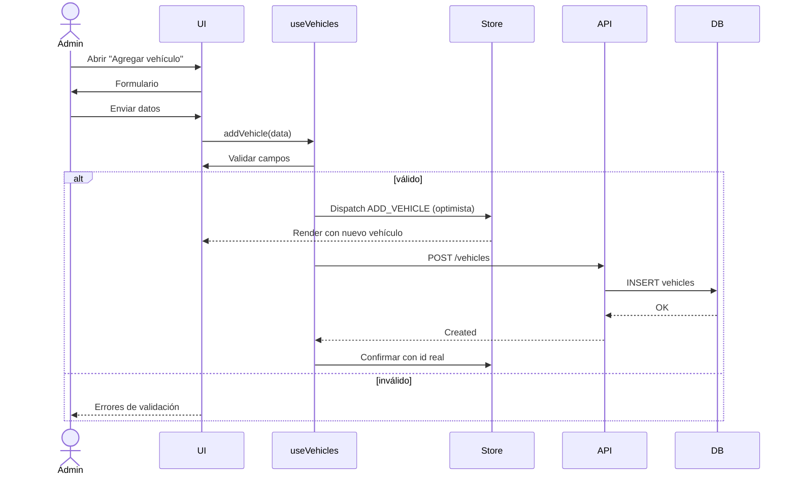

### UC2 Actualizar Datos Vehículo
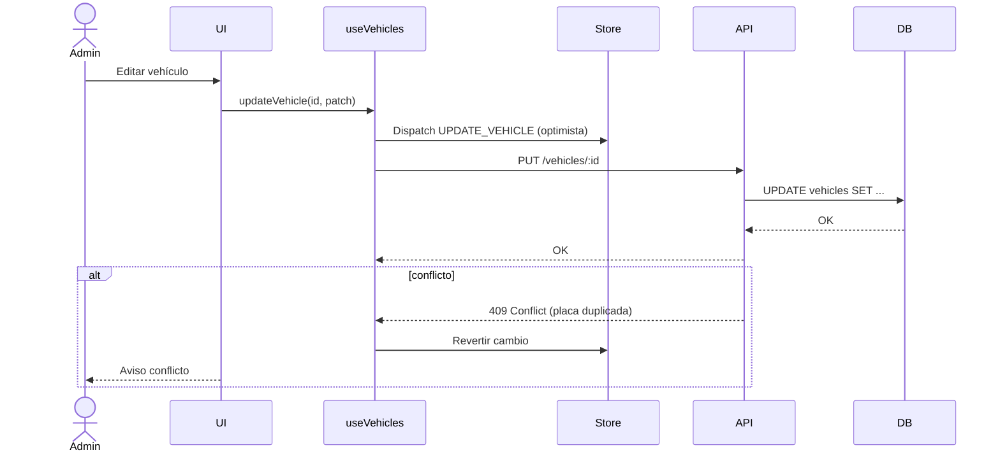

### UC3 Eliminar Vehículo
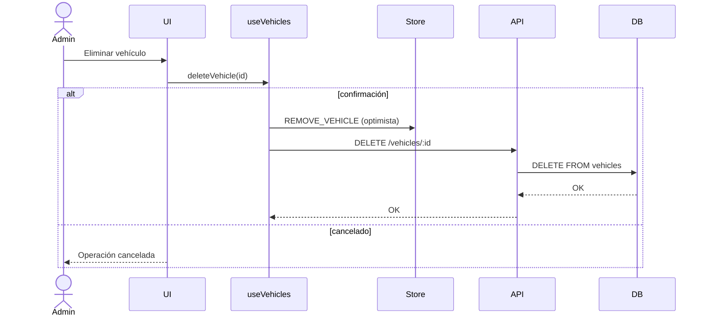

### UC4 Consultar Vehículos
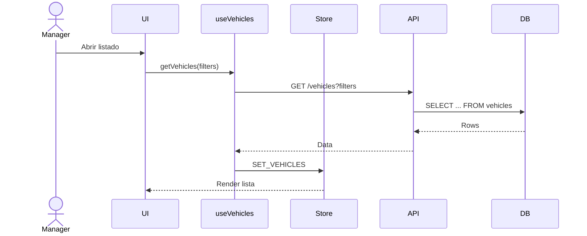

### UC5 Rastrear Ubicación Tiempo Real
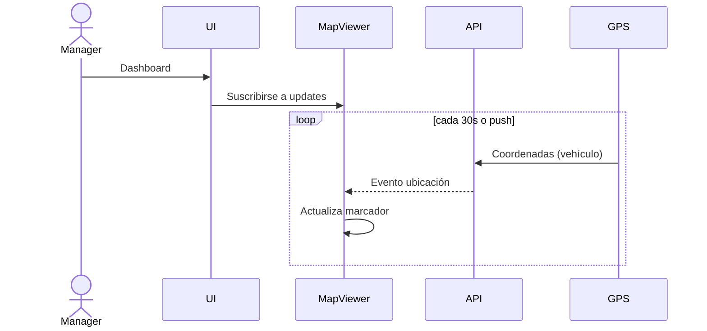

### UC6 Monitorear Combustible
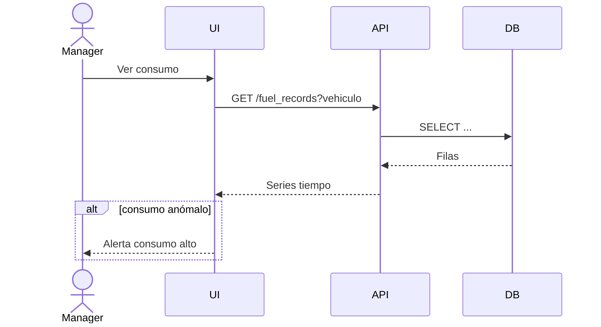

### UC7 Ver Historial Vehículo
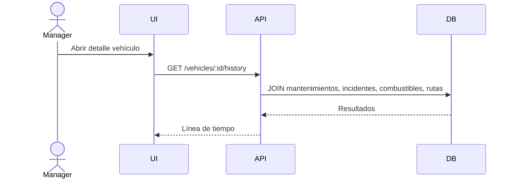

### UC8 Asociar Vehículo a Conductor
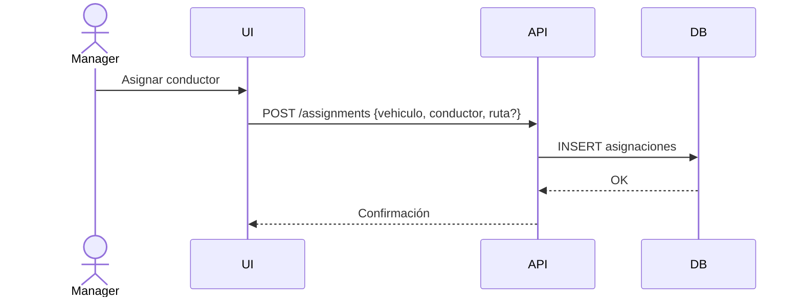

### UC9 Ver Geocercas
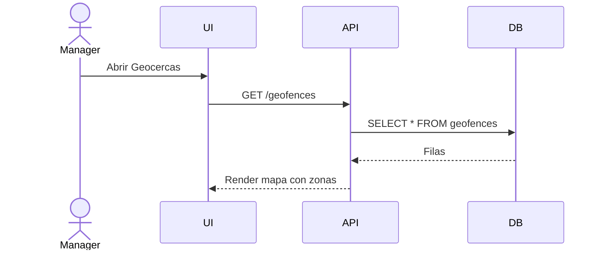

---
## Módulo Conductores (UC10–UC16)

### UC10 Registrar Conductor
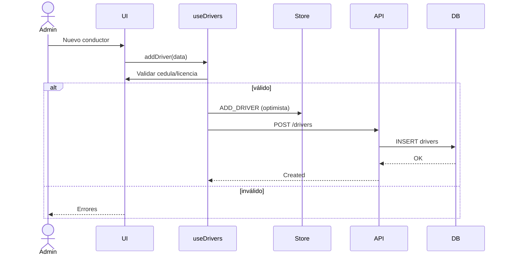

### UC11 Actualizar Datos Conductor
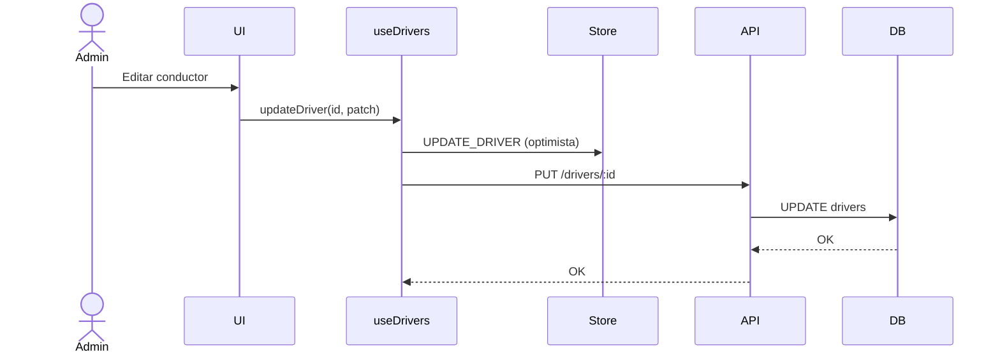

### UC12 Eliminar Conductor
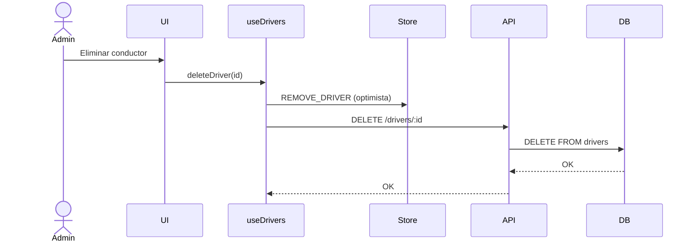

### UC13 Consultar Conductores
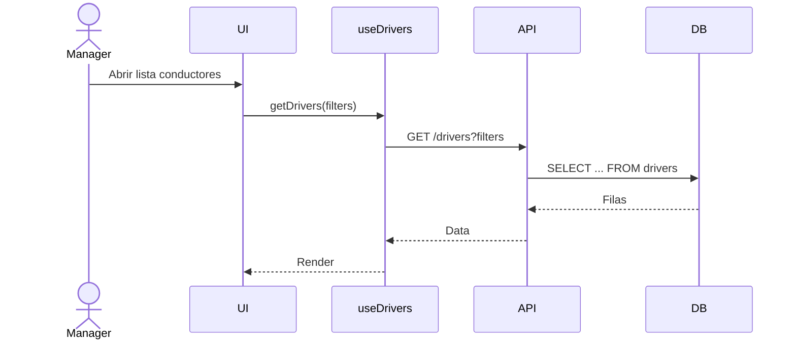

### UC14 Ver Historial Conductor
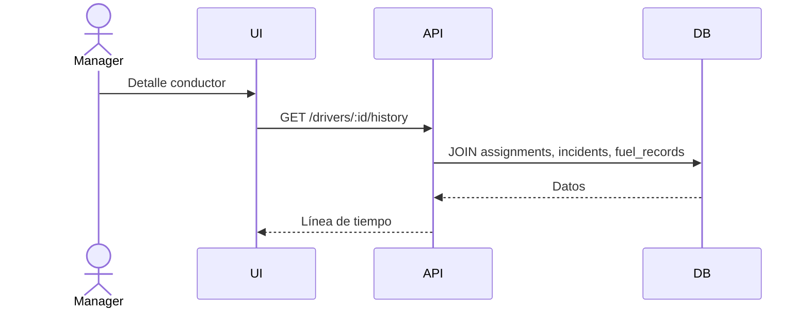

### UC15 Gestionar Horarios y Turnos
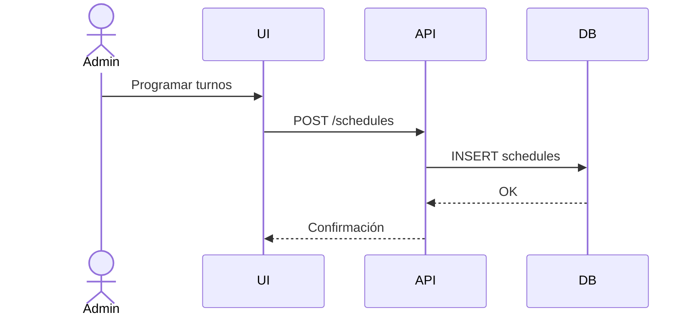

### UC16 Ver Incidentes (por conductor)
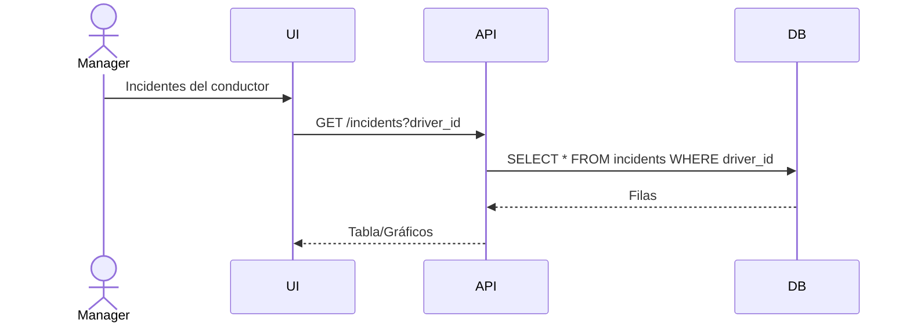

---
## Módulo Mantenimiento (UC17–UC21)

### UC17 Programar Mantenimiento
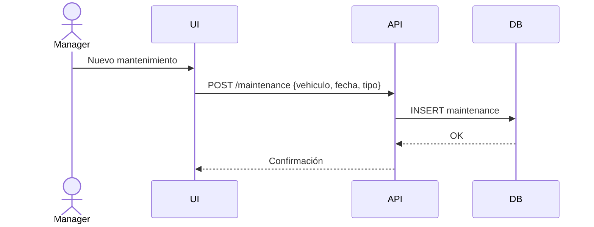

### UC18 Registrar Mantenimiento Realizado
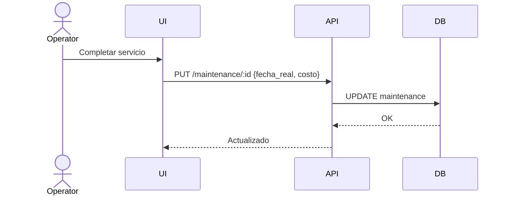

### UC19 Consultar Historial Mantenimiento
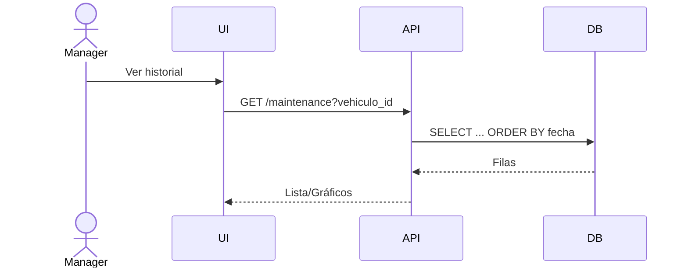

### UC20 Generar Alerta Mantenimiento
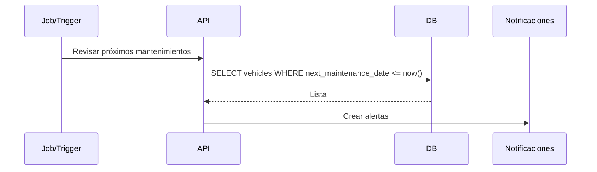

### UC21 Calcular Próximo Mantenimiento
```mermaid
sequenceDiagram
  participant Job as Job/Batch
  participant API
  participant DB
  Job->>API: Recalcular por uso/kilometraje
  API->>DB: Leer mantenimientos y odómetros
  API-->>DB: UPDATE vehicles.next_maintenance_date
```

---
## Módulo Rutas (UC22–UC27)

### UC22 Crear Ruta
```mermaid
sequenceDiagram
  actor Manager
  participant UI
  participant API
  participant DB
  Manager->>UI: Definir origen/destino
  UI->>API: POST /routes {waypoints}
  API->>DB: INSERT routes (+ route_stops)
  DB-->>API: OK
  API-->>UI: Ruta creada
```

### UC23 Asignar Ruta a Vehículo/Conductor
```mermaid
sequenceDiagram
  actor Manager
  participant UI
  participant API
  participant DB
  Manager->>UI: Asignar
  UI->>API: POST /assignments {route, vehicle, driver}
  API->>DB: INSERT assignments
  DB-->>API: OK
  API-->>UI: Confirmación
```

### UC24 Monitorear Ruta en Progreso
```mermaid
sequenceDiagram
  actor Operator
  participant UI
  participant API
  participant GPS
  Operator->>UI: Ver ruta activa
  loop tracking
    GPS->>API: Posición vehículo
    API-->>UI: Actualización ETA/avance
  end
```

### UC25 Finalizar Ruta
```mermaid
sequenceDiagram
  actor Operator
  participant UI
  participant API
  participant DB
  Operator->>UI: Cerrar ruta
  UI->>API: PUT /routes/:id {status: completed}
  API->>DB: UPDATE routes
  DB-->>API: OK
  API-->>UI: Estado actualizado
```

### UC26 Optimizar Rutas
```mermaid
sequenceDiagram
  actor Manager
  participant UI
  participant Maps
  participant API
  Manager->>UI: Solicitar optimización
  UI->>Maps: Calcular mejor orden paradas
  Maps-->>UI: Itinerario optimizado
  UI-->>API: PUT /routes/:id {stops: optimizadas}
```

### UC27 Comparar Ruta Planificada vs Real
```mermaid
sequenceDiagram
  actor Manager
  participant UI
  participant API
  participant DB
  Manager->>UI: Ver desvíos y KPIs
  UI->>API: GET /routes/:id/compare
  API->>DB: Consultar posiciones reales y plan
  DB-->>API: Datos
  API-->>UI: Reporte diferencias
```

---
## Módulo Alertas (UC28–UC33)

### UC28 Ver Alertas Activas
```mermaid
sequenceDiagram
  actor Operator
  participant UI
  participant API
  participant DB
  Operator->>UI: Pantalla de alertas
  UI->>API: GET /alerts?is_resolved=false
  API->>DB: SELECT * FROM alerts WHERE is_resolved=false
  DB-->>API: Filas
  API-->>UI: Lista
```

### UC29 Generar Alerta Automática
```mermaid
sequenceDiagram
  participant Rule as Motor de Reglas
  participant API
  participant DB
  participant Notif as Notificaciones
  Rule->>API: Condición cumplida (speed/geofence)
  API->>DB: INSERT alerts
  DB-->>API: OK
  API->>Notif: Enviar notificación
```

### UC30 Descartar Alerta
```mermaid
sequenceDiagram
  actor Operator
  participant UI
  participant API
  participant DB
  Operator->>UI: Marcar como resuelta
  UI->>API: PUT /alerts/:id {is_resolved: true}
  API->>DB: UPDATE alerts
  DB-->>API: OK
  API-->>UI: Actualizada
```

### UC31 Configurar Notificaciones
```mermaid
sequenceDiagram
  actor Manager
  participant UI
  participant API
  participant DB
  Manager->>UI: Preferencias de alerta
  UI->>API: PUT /settings/alerts
  API->>DB: UPDATE settings
  DB-->>API: OK
```

### UC32 Configurar Geocercas
```mermaid
sequenceDiagram
  actor Manager
  participant UI
  participant API
  participant DB
  Manager->>UI: Crear/editar geocerca
  UI->>API: POST/PUT /geofences
  API->>DB: INSERT/UPDATE geofences
  DB-->>API: OK
```

### UC33 Alertas por Velocidad/Detención/Desvío
```mermaid
sequenceDiagram
  participant GPS
  participant API
  participant Rule as Reglas
  participant DB
  GPS->>API: Telemetría
  API->>Rule: Evaluar
  alt Exceso velocidad o desvío
    Rule->>DB: INSERT alerts
  end
```

---
## Módulo Incidentes (UC34–UC36)

### UC34 Reportar Incidente/Emergencia
```mermaid
sequenceDiagram
  actor Driver
  participant UI
  participant API
  participant Notif
  participant DB
  Driver->>UI: Botón de pánico / Reporte
  UI->>API: POST /incidents
  API->>DB: INSERT incidents
  DB-->>API: OK
  API->>Notif: Aviso a supervisores
```

### UC35 Recibir Notificación de Incidente
```mermaid
sequenceDiagram
  participant Notif
  actor Manager
  participant UI
  Notif->>Manager: Push (incidente)
  Manager->>UI: Abrir incidente
  UI-->>Manager: Detalle y mapa
```

### UC36 Generar Reporte de Incidentes
```mermaid
sequenceDiagram
  actor Manager
  participant UI
  participant API
  participant DB
  Manager->>UI: Filtros por fecha/tipo
  UI->>API: GET /incidents?filters
  API->>DB: SELECT agregaciones
  DB-->>API: Resultados
  API-->>UI: Tablas y gráficos
```

---
## Módulo Reportes (UC37–UC44)

### UC37–UC40 Reportes Vehículos/Conductores/Mantenimiento/Combustible
```mermaid
sequenceDiagram
  actor Manager
  participant UI
  participant API
  participant DB
  Manager->>UI: Selecciona tipo + filtros
  UI->>API: GET /reports/{tipo}?filters
  API->>DB: Queries y agregaciones
  DB-->>API: Dataset
  API-->>UI: Render reporte
```

### UC41 Exportar Reporte PDF
```mermaid
sequenceDiagram
  actor Manager
  participant UI
  participant Export
  Manager->>UI: Exportar PDF
  UI->>Export: Generar PDF
  Export-->>Manager: Descarga
```

### UC42 Exportar Reporte Excel
```mermaid
sequenceDiagram
  actor Manager
  participant UI
  participant Export
  Manager->>UI: Exportar Excel
  UI->>Export: Generar XLSX
  Export-->>Manager: Descarga
```

### UC43 Ver Dashboard KPIs
```mermaid
sequenceDiagram
  actor Viewer
  participant UI
  participant API
  participant DB
  Viewer->>UI: Abrir dashboard
  UI->>API: GET /kpis
  API->>DB: Agregaciones
  DB-->>API: Métricas
  API-->>UI: Tarjetas y gráficos
```

### UC44 Reportes Personalizados
```mermaid
sequenceDiagram
  actor Manager
  participant UI
  participant API
  participant DB
  Manager->>UI: Constructor de consultas
  UI->>API: POST /reports/custom {query}
  API->>DB: Ejecutar consulta parametrizada
  DB-->>API: Resultado
  API-->>UI: Visualización
```

---
## Módulo Integraciones (UC45–UC47)

### UC45 Integrar con Tráfico/Mapas
```mermaid
sequenceDiagram
  actor Manager
  participant UI
  participant Maps
  participant API
  Manager->>UI: Conectar proveedor
  UI->>Maps: OAuth / API Key
  Maps-->>UI: Token válido
  UI-->>API: Guardar credenciales
```

### UC46 Integrar con ERP
```mermaid
sequenceDiagram
  actor Admin
  participant UI
  participant API
  participant ERP
  Admin->>UI: Configurar ERP
  UI->>API: Guardar configuración
  UI->>API: Sincronizar maestros
  API->>ERP: Pull/Push datos
  ERP-->>API: OK/Errores
```

### UC47 Comunicación Central-Conductor
```mermaid
sequenceDiagram
  actor Manager
  participant UI
  participant API
  actor Driver
  Manager->>UI: Enviar mensaje
  UI->>API: POST /messages {destinatario}
  API-->>Driver: Push/App móvil
  Driver-->>API: Respuesta/ACK
  API-->>UI: Entregado
```

---
## Configuración y Seguridad (UC48–UC51)

### UC48 Gestionar Usuarios y Roles
```mermaid
sequenceDiagram
  actor Admin
  participant UI
  participant API
  participant DB
  Admin->>UI: Gestión de usuarios
  UI->>API: GET/POST/PUT/DELETE /users
  API->>DB: SELECT/INSERT/UPDATE/DELETE
  DB-->>API: OK
  API-->>UI: Cambios reflejados
```

### UC49 Configurar Parámetros del Sistema
```mermaid
sequenceDiagram
  actor Admin
  participant UI
  participant API
  participant DB
  Admin->>UI: Cambiar parámetros
  UI->>API: PUT /settings
  API->>DB: UPDATE settings
  DB-->>API: OK
```

### UC50 Configurar Políticas de Privacidad
```mermaid
sequenceDiagram
  actor Admin
  participant UI
  participant API
  participant DB
  Admin->>UI: Políticas
  UI->>API: PUT /policies/privacy
  API->>DB: UPDATE policies
  DB-->>API: OK
```

### UC51 Almacenar Datos Históricos
```mermaid
sequenceDiagram
  participant Job
  participant API
  participant DB
  Job->>API: Archivar datos antiguos
  API->>DB: INSERT INTO archive_* SELECT ...
  DB-->>API: OK
```

---
## Autenticación (UC52–UC55)

### UC52 Iniciar Sesión
```mermaid
sequenceDiagram
  actor User as Usuario
  participant UI
  participant Auth as AuthService
  participant API
  User->>UI: Email/Password
  UI->>Auth: signIn(credentials)
  alt éxito
    Auth-->>UI: Session/JWT
    UI->>API: GET /me
    API-->>UI: Perfil/Permisos
  else error
    Auth-->>UI: Credenciales inválidas
  end
```

### UC53 Cerrar Sesión
```mermaid
sequenceDiagram
  actor User
  participant UI
  participant Auth
  User->>UI: Logout
  UI->>Auth: signOut()
  Auth-->>UI: Sesión finalizada
```

### UC54 Recuperar Contraseña
```mermaid
sequenceDiagram
  actor User
  participant UI
  participant Auth
  participant Notif
  User->>UI: Solicita reset
  UI->>Auth: resetPassword(email)
  Auth->>Notif: Enviar email con token
  Notif-->>User: Link de recuperación
```

### UC55 Cambiar Contraseña
```mermaid
sequenceDiagram
  actor User
  participant UI
  participant Auth
  User->>UI: Nueva contraseña (token)
  UI->>Auth: updatePassword(token, pwd)
  Auth-->>UI: OK
```

---
## Casos de uso potenciales

### Auditoría de Cambios (complementario a CRUD)
```mermaid
sequenceDiagram
  participant Trigger
  participant DB
  Trigger->>DB: BEFORE INSERT/UPDATE/DELETE
  DB->>DB: INSERT audit_log(table, row_id, action, user)
```

### Gestión de Talleres/Proveedores
```mermaid
sequenceDiagram
  actor Manager
  participant UI
  participant API
  participant DB
  Manager->>UI: CRUD talleres
  UI->>API: /vendors (GET/POST/PUT/DELETE)
  API->>DB: Operaciones sobre vendors
  DB-->>API: OK
```

### Importación CSV de Vehículos
```mermaid
sequenceDiagram
  actor Admin
  participant UI
  participant Import as ImportService
  participant API
  participant DB
  Admin->>UI: Subir CSV
  UI->>Import: Parse + validar
  Import->>API: Bulk upsert
  API->>DB: COPY/UPSERT vehicles
```


## Notas

- Los nombres de endpoints son representativos; en Supabase pueden ser RPCs o acceso directo por tablas.
- Las secuencias siguen el patrón arquitectura: UI → Hook → Store → API → DB.
- Ajustar detalles según políticas RLS y multiempresa si se activa.
