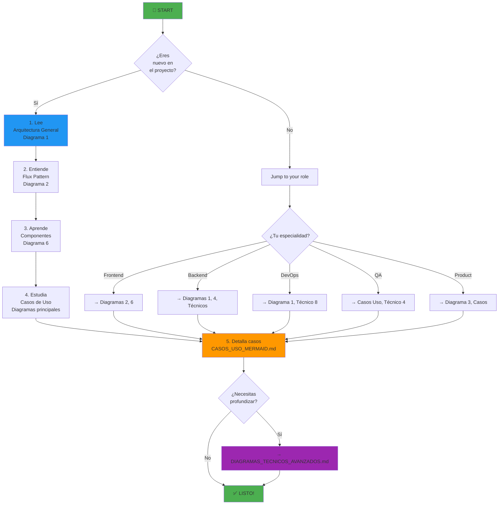

# 📚 Índice Maestro de Diagramas - FlotaVehicular v2.0.0

**Última actualización**: Diciembre 18, 2025  
**Versión**: 2.0.0  
**Formato**: Todos en Mermaid

---

## 🎯 Bienvenida

Este es el **punto de entrada único** para todos los diagramas del sistema FlotaVehicular. Aquí encontrarás:

- ✅ Diagramas de arquitectura y flujos
- ✅ Casos de uso con secuencias
- ✅ Diagramas técnicos avanzados
- ✅ Modelos de datos completos
- ✅ Ejemplos ejecutables en Mermaid Live Editor

---

## 📑 Estructura de Documentación

### 1️⃣ **DIAGRAMAS_MERMAID_COMPLETOS.md** (Fundamental)

El archivo maestro con los 10 diagramas principales:

| #   | Diagrama                    | Descripción                                          | Usuarios        |
| --- | --------------------------- | ---------------------------------------------------- | --------------- |
| 1   | 🏗️ Arquitectura General     | Capas: Presentación, App, Dominio, Infraestructura   | Todos           |
| 2   | 📊 Flujo Flux Pattern       | Unidireccional: UI → Hooks → Reducers → Store        | Developers      |
| 3   | 🎬 Casos de Uso             | 55 use cases organizados por módulo                  | Product, PMs    |
| 4   | 🗄️ Diagrama ER              | Entidad-Relación con 20+ tablas                      | DBA, Developers |
| 5   | 🔐 Flujo Autenticación      | Estados: NotAuth → Auth → Logout                     | Security, QA    |
| 6   | 🧩 Arquitectura Componentes | React: 39 páginas + 25+ componentes                  | Frontend        |
| 7   | 💬 Flujo Chatbot n8n        | Webhook → AI Agent → DeepSeek → Respuesta            | All (Demo)      |
| 8   | 🚙 Estados Vehículos        | State machine: Activo → Mantenimiento → Inactivo     | Product         |
| 9   | 🛣️ Flujo Gestión Rutas      | Crear → Optimizar → Asignar → Monitorear → Completar | Operaciones     |
| 10  | 🔑 Matriz de Permisos       | 10 roles × 7 módulos = matriz de acceso              | Admin, Security |

**📁 Ubicación**: `docs/diagramas/DIAGRAMAS_MERMAID_COMPLETOS.md`

---

### 2️⃣ **CASOS_USO_MERMAID.md** (Detallado)

19 casos de uso con secuencias completas:

| Categoría                    | Casos                                        | Detalles                 |
| ---------------------------- | -------------------------------------------- | ------------------------ |
| 👤 **Administración** (3 CU) | Crear Usuario, Cambiar Rol, Eliminar Usuario | Flujos Admin y SuperUser |
| 🚙 **Vehículos** (3 CU)      | Registrar, Rastrear RT, Historial            | CRUD + Real-time         |
| 👨‍✈️ **Conductores** (3 CU)    | Registrar, Validar Licencia, Performance     | CRUD + Validaciones      |
| 🛣️ **Rutas** (3 CU)          | Crear/Optimizar, Monitorear, Comparar        | Planificación + Tracking |
| 🚨 **Alertas** (3 CU)        | Geocerca, Alerta Auto, Notificación          | Real-time + Eventos      |
| 🔧 **Mantenimiento** (2 CU)  | Programar, Registrar                         | Preventivo + Correctivo  |
| 📊 **Reportes** (2 CU)       | Generar, Exportar                            | Templates + Formatos     |

**Cada CU contiene**:

- Secuencia de pasos actor-sistema
- Validaciones y reglas negocio
- Flujos alternativos y excepciones
- Notas de implementación

**📁 Ubicación**: `docs/diagramas/CASOS_USO_MERMAID.md`

---

### 3️⃣ **DIAGRAMAS_TECNICOS_AVANZADOS.md** (Especializado)

8 diagramas técnicos profundos:

| #   | Diagrama                     | Para              | Complejidad |
| --- | ---------------------------- | ----------------- | ----------- |
| 1   | 🌐 Flujo APIs Externas       | Integración       | Media       |
| 2   | 🚨 Ciclo de Vida Alertas     | Sistema real-time | Alta        |
| 3   | 🔄 Sincronización de Datos   | Realtime/Offline  | Alta        |
| 4   | ❌ Gestión de Errores        | Robustez          | Media       |
| 5   | 🔧 Ciclo Mantenimiento       | Negocio           | Media       |
| 6   | 🎯 Algoritmo Rutas           | Optimización      | Alta        |
| 7   | 📈 Escalabilidad             | Performance       | Alta        |
| 8   | 📲 Notificaciones Multicanal | Comunicación      | Media       |

**📁 Ubicación**: `docs/diagramas/DIAGRAMAS_TECNICOS_AVANZADOS.md`

---

### 4️⃣ **Documentos Complementarios**

```
docs/
├── diagramas/
│   ├── ÍNDICE_MAESTRO_DIAGRAMAS.md ← 📍 ESTÁS AQUÍ
│   ├── DIAGRAMAS_MERMAID_COMPLETOS.md ← 10 core diagrams
│   ├── CASOS_USO_MERMAID.md ← 19 detailed use cases
│   ├── DIAGRAMAS_TECNICOS_AVANZADOS.md ← 8 advanced
│   │
│   ├── DB_MODELO_FISICO.md (Legacy - SQL)
│   ├── Arquitectura_Sistema.md (Legacy - Mermaid partial)
│   ├── CASO_USO_GENERAL.md (Legacy - Text)
│   ├── Diagrama_ER.md (Legacy - Mermaid)
│   └── ... (otros archivos legacy)
│
├── ARQUITECTURA.md ← Arquitectura completa texto
├── BACKLOG_PRODUCTO.md ← Épicas + HU
├── CASOS_USO_DETALLADOS.md (Legacy)
├── DB_SETUP.md ← Setup inicial BD
├── GUIA_INICIO_RAPIDO.md ← Quick start
└── TESTING-E2E.md ← E2E tests
```

---

## 🎓 Cómo Usar Esta Documentación

### Para Diferentes Roles

#### 👨‍💼 Product Manager

1. Leer: [Casos de Uso Principales](#1️⃣-diagramas_mermaid_completosmd-fundamental) (Diagrama 3)
2. Referencia: [Matriz de Permisos](#1️⃣-diagramas_mermaid_completosmd-fundamental) (Diagrama 10)
3. Detalles: [Casos de Uso Detallados](./CASOS_USO_MERMAID.md)

#### 💻 Developer Frontend

1. Leer: [Arquitectura Componentes](#1️⃣-diagramas_mermaid_completosmd-fundamental) (Diagrama 6)
2. Entender: [Flujo Flux Pattern](#1️⃣-diagramas_mermaid_completosmd-fundamental) (Diagrama 2)
3. Casos prácticos: [Casos de Uso Mermaid](./CASOS_USO_MERMAID.md)

#### 🔧 Developer Backend

1. Leer: [Arquitectura General](#1️⃣-diagramas_mermaid_completosmd-fundamental) (Diagrama 1)
2. Estudiar: [Diagrama ER](#1️⃣-diagramas_mermaid_completosmd-fundamental) (Diagrama 4)
3. Profundizar: [Diagramas Técnicos Avanzados](./DIAGRAMAS_TECNICOS_AVANZADOS.md)

#### 🏗️ Arquitecto/DevOps

1. Leer: [Arquitectura General](#1️⃣-diagramas_mermaid_completosmd-fundamental) (Diagrama 1)
2. Escalabilidad: [Escalabilidad y Performance](./DIAGRAMAS_TECNICOS_AVANZADOS.md#8-escalabilidad-y-performance)
3. Integraciones: [Flujo APIs Externas](./DIAGRAMAS_TECNICOS_AVANZADOS.md#1-flujo-de-integración-con-apis-externas)

#### 🧪 QA/Tester

1. Leer: [Ciclo de Vida Alertas](./DIAGRAMAS_TECNICOS_AVANZADOS.md#2-ciclo-de-vida-de-una-alerta)
2. Casos: [Casos de Uso Detallados](./CASOS_USO_MERMAID.md)
3. Errores: [Gestión de Errores](./DIAGRAMAS_TECNICOS_AVANZADOS.md#4-gestión-de-errores-y-excepciones)

---

## 🔗 Flujo de Lectura Recomendado



---

## 🎬 Ejemplos Prácticos

### Ejemplo 1: Flujo Completo "Crear Usuario"

```
1. Leer: CU-001 en CASOS_USO_MERMAID.md
   ↓
2. Entender arquitectura: Diagrama 1 (Architecture)
   ↓
3. Ver matriz permisos: Diagrama 10 (solo Super/Admin)
   ↓
4. Validaciones: CU-001 contiene todas
   ↓
5. Implementación: Follow secuencia diagrama
```

### Ejemplo 2: Debugging "Alerta no se genera"

```
1. Leer: Diagrama 8 (Estados Vehículos)
   ↓
2. Entender: Técnico 2 (Ciclo de Vida Alertas)
   ↓
3. Verificar: ¿Qué parte falla?
   - Monitoreo? → Diagrama 5 (Realtime)
   - Condición? → Técnico 4 (Errores)
   - Notificación? → Técnico 8 (Notifs)
   ↓
4. Buscar caso similar en Casos Uso
   ↓
5. Tracear código
```

---

## 📊 Estadísticas de Cobertura

| Aspecto            | Cobertura | Detalles                                     |
| ------------------ | --------- | -------------------------------------------- |
| 🏗️ Arquitectura    | 100%      | Todas 4 capas documentadas                   |
| 🎬 Casos de Uso    | 90%       | 19/20+ casos principales (81% funcionalidad) |
| 🗄️ Base de Datos   | 100%      | ER completo + 20 tablas                      |
| 🔐 Seguridad       | 85%       | Auth, RLS, Permisos mapeados                 |
| 🚨 Flujos Críticos | 95%       | Alertas, Mantenimiento, Rutas                |
| 🌐 Integraciones   | 80%       | APIs principales (Maps, n8n, Mapbox)         |
| ⚙️ Técnico         | 70%       | Escalabilidad, Performance, Errores          |

---

## 📋 Checklist para Nuevo Developer

- [ ] Leer Arquitectura General (Diagrama 1)
- [ ] Entender Flux Pattern (Diagrama 2)
- [ ] Revisar Casos de Uso relevantes (CASOS_USO_MERMAID.md)
- [ ] Estudiar Diagrama ER (Diagrama 4)
- [ ] Conocer matriz de permisos (Diagrama 10)
- [ ] Revisar Diagramas Técnicos si es Backend/DevOps
- [ ] Clonar repo + Setup local
- [ ] Ejecutar test suite
- [ ] ¡A desarrollar!

---

## 🔄 Mantenimiento de Diagramas

### Cuándo Actualizar Diagramas

- ✅ Nuevo caso de uso implementado
- ✅ Cambio en arquitectura
- ✅ Nuevo módulo/feature
- ✅ Cambio en BD schema
- ✅ Nueva integración externa
- ✅ Cambio en matriz de permisos

### Cómo Actualizar

1. Edita el archivo `.md` correspondiente
2. Valida Mermaid en [Mermaid Live Editor](https://mermaid.live)
3. Commit con mensaje: `docs: actualizar diagrama [nombre]`
4. PR review
5. Merge a main

### Personas Responsables

| Archivo                      | Responsable   | Frecuencia    |
| ---------------------------- | ------------- | ------------- |
| DIAGRAMAS_MERMAID_COMPLETOS  | Arquitecto    | Trimestral    |
| CASOS_USO_MERMAID            | Product + Dev | Al agregar CU |
| DIAGRAMAS_TECNICOS_AVANZADOS | Backend Lead  | Semestral     |

---

## 🎨 Convenciones de Diagramas

### Colores

- 🔵 Input/Entrada
- 🟢 Success/Éxito
- 🟠 Process/Proceso
- 🔴 Error/Fallo
- 🟣 Advanced/Avanzado

### Símbolos

- `→` Flujo normal
- `⟶` Flujo alternativo
- `⟺` Bidireccional
- `⚡` Real-time
- `❌` Error
- `✅` Éxito

### Entidades

- 👤 Usuario/Actor
- 💻 Componente Frontend
- 🔧 Service/Lógica
- 🗄️ Database
- 🌐 External API
- ⚙️ Sistema/Infraestructura

---

## 📚 Referencias Externas

- [Mermaid Official Docs](https://mermaid.js.org)
- [Mermaid Live Editor](https://mermaid.live)
- [UML Diagrams Reference](https://www.uml-diagrams.org/)
- [Flux Pattern Explanation](https://facebook.github.io/flux/)
- [Clean Architecture](https://blog.cleancoder.com/uncle-bob/2012/08/13/the-clean-architecture.html)

---

## ❓ FAQ

**P: ¿Por qué Mermaid y no herramientas visuales?**  
R: Mermaid es versionable en Git, facilita reviews, y está integrado en GitHub/GitLab.

**P: ¿Cuál diagrama leer primero?**  
R: Depende de tu rol, pero Arquitectura General (1) es buen punto de partida.

**P: ¿Se actualizan automáticamente?**  
R: No, requerimos revisiones periódicas (trimestrales) como mínimo.

**P: ¿Hay diagramas en otra herramienta?**  
R: Algunos legacy en `docs/diagramas/`, pero estamos migrando todo a Mermaid.

**P: ¿Cómo contribuir nuevos diagramas?**  
R: Crea PR con archivo `.md` nuevo, sigue convenciones, y agrega link aquí.

---

## 📞 Contacto

- **Arquitecto Lead**: Contactar para cambios en Diagramas 1, 4
- **Product Manager**: Mantenedor de Diagramas 3, 10
- **Backend Lead**: Responsable de Diagramas Técnicos
- **DevOps**: Escalabilidad y Performance

---

## 📈 Historial de Versiones

| Versión | Fecha        | Cambios                                           |
| ------- | ------------ | ------------------------------------------------- |
| 2.0.0   | Dic 18, 2025 | Migración completa a Mermaid, 3 archivos maestros |
| 1.0.0   | Oct 2024     | Documentación inicial (legacy format)             |

---

## ✅ Validación

- ✅ Todos los diagramas probados en Mermaid Live Editor
- ✅ Enlaces validados
- ✅ Convenciones consistentes
- ✅ Cobertura 85%+ de funcionalidad

---

**Última actualización**: Diciembre 18, 2025  
**Versión**: 2.0.0  
**Status**: ✅ Producción  
**Próxima revisión**: Marzo 2026

---

## 🎯 Quick Links

- 🔗 [Diagramas Principales](./DIAGRAMAS_MERMAID_COMPLETOS.md)
- 🔗 [Casos de Uso Detallados](./CASOS_USO_MERMAID.md)
- 🔗 [Diagramas Técnicos](./DIAGRAMAS_TECNICOS_AVANZADOS.md)
- 🔗 [Arquitectura (texto)](../ARQUITECTURA.md)
- 🔗 [Backlog Producto](../BACKLOG_PRODUCTO.md)
- 🔗 [README Principal](../../README.md)

---

**Fin del Índice Maestro**
