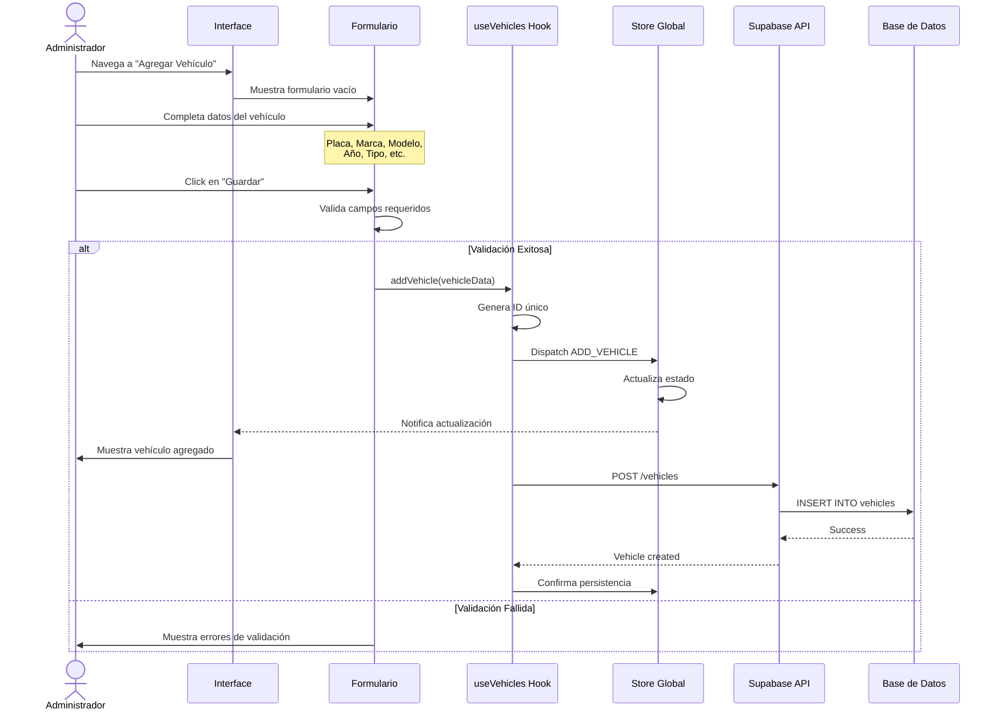
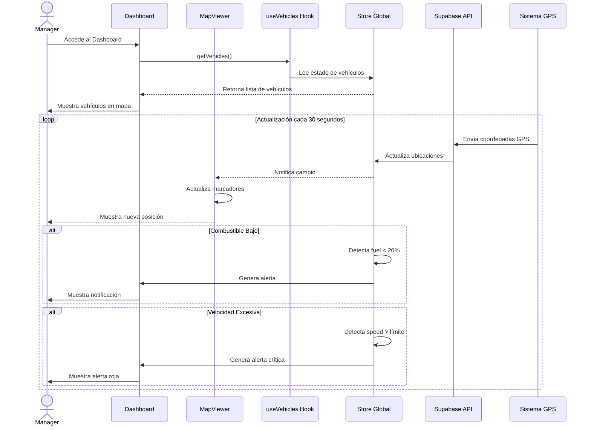
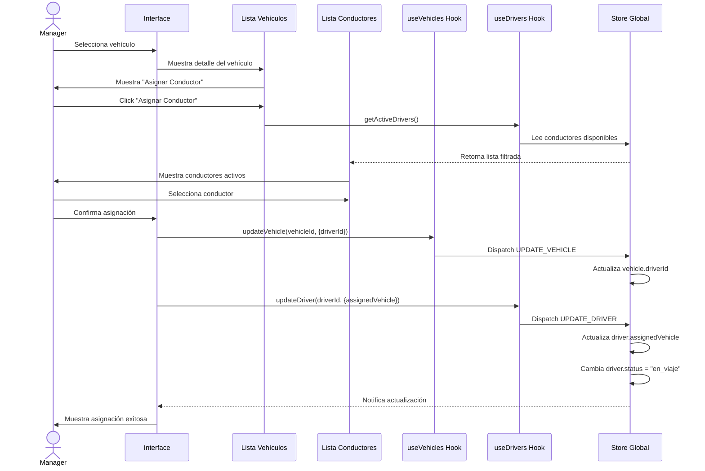
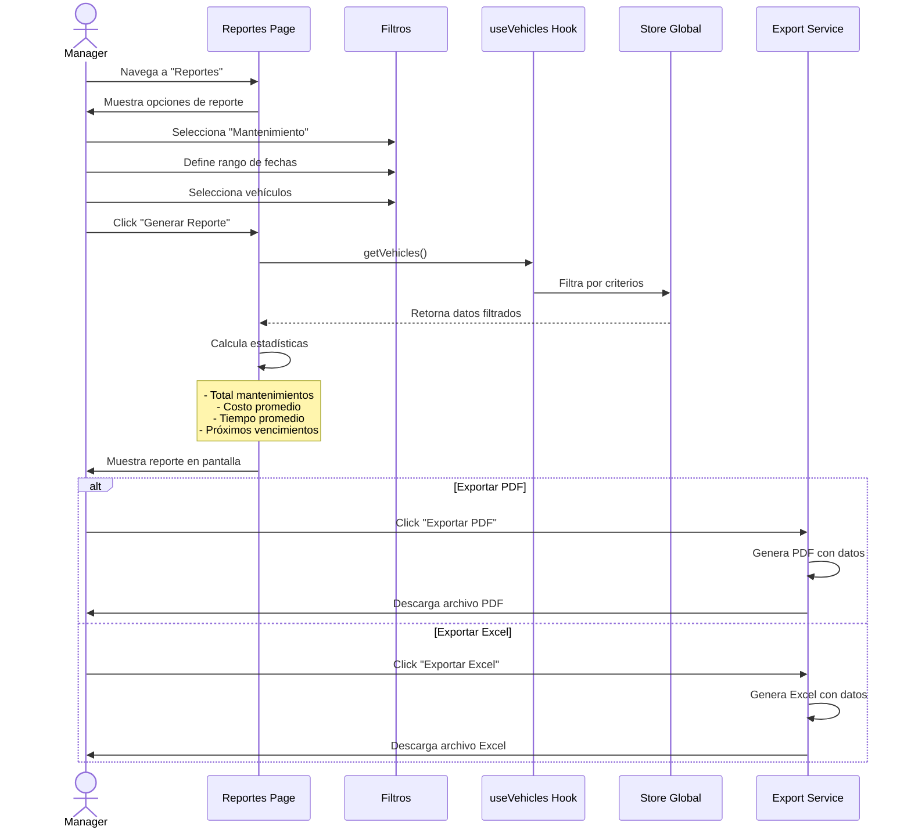
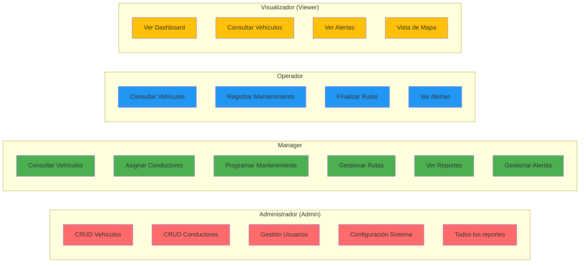

# Diagramas de Casos de Uso

## Diagrama General de Casos de Uso

```mermaid
%%{init: {'theme':'base', 'themeVariables': { 'primaryColor':'#61DAFB'}}}%%
graph TB
    subgraph Sistema["Sistema de Gestión de Flota"]
        subgraph ModuloVehiculos["Módulo de Vehículos"]
            UC1[Registrar Vehículo]
            UC2[Actualizar Datos Vehículo]
            UC3[Eliminar Vehículo]
            UC4[Consultar Vehículos]
            UC5[Rastrear Ubicación Tiempo Real]
            UC6[Monitorear Combustible]
            UC7[Ver Historial Vehículo]
        end
        
        subgraph ModuloConductores["Módulo de Conductores"]
            UC8[Registrar Conductor]
            UC9[Actualizar Datos Conductor]
            UC10[Eliminar Conductor]
            UC11[Consultar Conductores]
            UC12[Asignar Vehículo a Conductor]
            UC13[Desasignar Vehículo]
            UC14[Ver Historial Conductor]
        end
        
        subgraph ModuloMantenimiento["Módulo de Mantenimiento"]
            UC15[Programar Mantenimiento]
            UC16[Registrar Mantenimiento Realizado]
            UC17[Consultar Historial Mantenimiento]
            UC18[Generar Alerta Mantenimiento]
            UC19[Calcular Próximo Mantenimiento]
        end
        
        subgraph ModuloRutas["Módulo de Rutas"]
            UC20[Crear Ruta]
            UC21[Asignar Ruta a Vehículo]
            UC22[Monitorear Ruta en Progreso]
            UC23[Finalizar Ruta]
            UC24[Optimizar Rutas]
        end
        
        subgraph ModuloAlertas["Módulo de Alertas"]
            UC25[Ver Alertas Activas]
            UC26[Generar Alerta Automática]
            UC27[Descartar Alerta]
            UC28[Configurar Notificaciones]
        end
        
        subgraph ModuloReportes["Módulo de Reportes"]
            UC29[Generar Reporte Vehículos]
            UC30[Generar Reporte Conductores]
            UC31[Generar Reporte Mantenimiento]
            UC32[Generar Reporte Combustible]
            UC33[Exportar Reporte PDF]
            UC34[Exportar Reporte Excel]
            UC35[Ver Dashboard KPIs]
        end
        
        subgraph ModuloAuth["Módulo de Autenticación"]
            UC36[Iniciar Sesión]
            UC37[Cerrar Sesión]
            UC38[Recuperar Contraseña]
            UC39[Cambiar Contraseña]
        end
    end
    
    Admin((Administrador))
    Manager((Manager))
    Operator((Operador))
    Viewer((Visualizador))
    Sistema_Externo[Sistema Externo<br/>GPS/Sensores]
    
    Admin --> UC1
    Admin --> UC2
    Admin --> UC3
    Admin --> UC8
    Admin --> UC9
    Admin --> UC10
    Admin --> UC15
    Admin --> UC28
    Admin --> UC39
    
    Manager --> UC4
    Manager --> UC5
    Manager --> UC6
    Manager --> UC7
    Manager --> UC11
    Manager --> UC12
    Manager --> UC13
    Manager --> UC14
    Manager --> UC16
    Manager --> UC17
    Manager --> UC20
    Manager --> UC21
    Manager --> UC22
    Manager --> UC23
    Manager --> UC24
    Manager --> UC25
    Manager --> UC27
    Manager --> UC29
    Manager --> UC30
    Manager --> UC31
    Manager --> UC32
    Manager --> UC33
    Manager --> UC34
    Manager --> UC35
    
    Operator --> UC4
    Operator --> UC5
    Operator --> UC11
    Operator --> UC16
    Operator --> UC22
    Operator --> UC23
    Operator --> UC25
    
    Viewer --> UC4
    Viewer --> UC5
    Viewer --> UC11
    Viewer --> UC25
    Viewer --> UC35
    
    Admin --> UC36
    Admin --> UC37
    Manager --> UC36
    Manager --> UC37
    Operator --> UC36
    Operator --> UC37
    Viewer --> UC36
    Viewer --> UC37
    
    Sistema_Externo -.-> UC5
    Sistema_Externo -.-> UC6
    Sistema_Externo -.-> UC26
    
    UC26 --> UC18
    UC19 --> UC18
```

## Caso de Uso Detallado: Registrar Vehículo

## Caso de Uso Detallado: Monitorear Vehículo en Tiempo Real

## Caso de Uso Detallado: Asignar Conductor a Vehículo

## Caso de Uso: Generar Reporte de Mantenimiento

## Matriz de Casos de Uso por Rol

