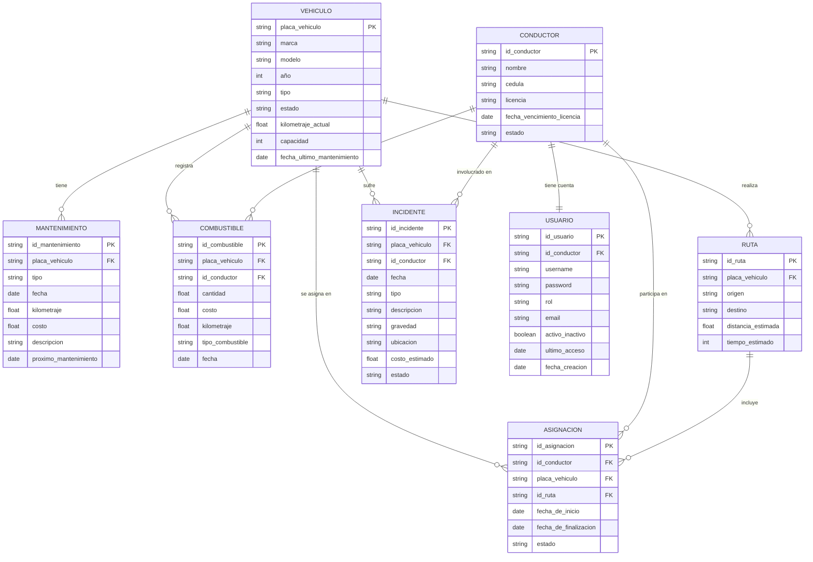

# Diagrama Entidad-Relación (ER)

## Descripción

Este diagrama representa el **modelo de datos relacional** del sistema de gestión de flota vehicular. Muestra las entidades principales del negocio, sus atributos y las relaciones entre ellas, implementadas en una base de datos PostgreSQL a través de Supabase.

### Entidades Principales

1. **VEHÍCULO** - Núcleo del sistema, representa cada unidad de la flota
   - Atributos identificativos: placa, marca, modelo, año
   - Atributos operativos: tipo, estado, kilometraje actual, capacidad
   - Control: fecha del último mantenimiento

2. **CONDUCTOR** - Personal autorizado para operar los vehículos
   - Datos personales: nombre, cédula
   - Credenciales: licencia, fecha de vencimiento
   - Estado: activo/inactivo

3. **ASIGNACIÓN** - Relaciona conductores con vehículos y rutas
   - Datos temporales: fecha inicio, fecha finalización
   - Referencias: conductor, vehículo, ruta
   - Estado actual de la asignación

4. **RUTA** - Trayectos planificados para los vehículos
   - Ubicaciones: origen, destino
   - Métricas: distancia estimada, tiempo estimado

5. **INCIDENTE** - Registro de eventos durante operación
   - Clasificación: tipo, gravedad
   - Detalles: descripción, ubicación, costo estimado
   - Referencias: vehículo, conductor involucrados
   - Temporal: fecha del incidente, estado

6. **MANTENIMIENTO** - Control de servicios preventivos/correctivos
   - Clasificación: tipo (preventivo/correctivo)
   - Datos operativos: fecha, kilometraje, costo
   - Planificación: próximo mantenimiento
   - Referencia: vehículo

7. **COMBUSTIBLE** - Control de consumo y costos
   - Mediciones: cantidad, costo, kilometraje
   - Clasificación: tipo de combustible
   - Referencias: vehículo, conductor
   - Temporal: fecha de carga

8. **USUARIO** - Acceso y permisos al sistema
   - Autenticación: username, password, email
   - Autorización: rol (admin/operador/conductor)
   - Vinculación: conductor (si aplica)
   - Control: activo/inactivo, último acceso, fecha creación

### Relaciones y Cardinalidad

- **VEHÍCULO ↔ MANTENIMIENTO** (1:N)
  - Un vehículo puede tener múltiples mantenimientos
  - Cada mantenimiento pertenece a un solo vehículo

- **VEHÍCULO ↔ COMBUSTIBLE** (1:N)
  - Un vehículo registra múltiples cargas de combustible
  - Cada carga pertenece a un solo vehículo

- **VEHÍCULO ↔ RUTA** (1:N)
  - Un vehículo puede realizar múltiples rutas
  - Cada ruta es asignada a un vehículo

- **VEHÍCULO ↔ INCIDENTE** (1:N)
  - Un vehículo puede tener múltiples incidentes
  - Cada incidente involucra un vehículo

- **CONDUCTOR ↔ ASIGNACIÓN** (1:N)
  - Un conductor puede tener múltiples asignaciones (históricas y activas)
  - Cada asignación pertenece a un conductor

- **CONDUCTOR ↔ COMBUSTIBLE** (1:N)
  - Un conductor registra múltiples cargas de combustible
  - Cada carga es realizada por un conductor

- **CONDUCTOR ↔ INCIDENTE** (1:N)
  - Un conductor puede estar involucrado en múltiples incidentes
  - Cada incidente involucra a un conductor

- **CONDUCTOR ↔ USUARIO** (1:1)
  - Un conductor tiene una cuenta de usuario en el sistema
  - Un usuario puede estar vinculado a un conductor

- **ASIGNACIÓN** (Entidad de relación N:M entre CONDUCTOR, VEHÍCULO y RUTA)
  - Conecta las tres entidades principales de operación
  - Incluye datos propios: fechas de inicio/fin, estado

### Integridad Referencial

- **Claves Primarias (PK)**: Identificadores únicos para cada entidad
  - `id_mantenimiento`, `placa_vehiculo`, `id_conductor`, etc.

- **Claves Foráneas (FK)**: Mantienen la integridad referencial
  - Ejemplo: `MANTENIMIENTO.placa_vehiculo` → `VEHÍCULO.placa_vehiculo`
  - Garantizan que no existan referencias huérfanas

### Consideraciones de Diseño

1. **Normalización**: El esquema está normalizado para evitar redundancia
2. **Trazabilidad**: Cada operación mantiene registro de fecha y responsable
3. **Escalabilidad**: La estructura permite agregar nuevas entidades sin afectar las existentes
4. **Auditoría**: Campos de estado y fechas permiten seguimiento histórico
5. **Seguridad**: La tabla USUARIO maneja roles y permisos de acceso

## Diagrama

## Migraciones de Base de Datos

Las tablas de este diagrama están implementadas en Supabase mediante migraciones SQL ubicadas en:

- `supabase/migrations/20240115000001_initial_schema.sql`
- `supabase/migrations/20250918051927_white_temple.sql`

## Políticas de Seguridad (RLS)

Cada tabla implementa **Row Level Security** en Supabase para:

- Controlar acceso según rol de usuario
- Prevenir modificaciones no autorizadas
- Auditar cambios en datos sensibles

## Índices y Optimización

- Índices en claves foráneas para mejorar JOIN performance
- Índices en campos de búsqueda frecuente (placa, cédula, estado)
- Índices compuestos para consultas de reportes

## Referencias

- Ver esquema completo: `supabase/migrations/`
- Documentación de arquitectura: `docs/ARCHITECTURE.md`
- Infraestructura: `docs/INFRASTRUCTURE.md`
